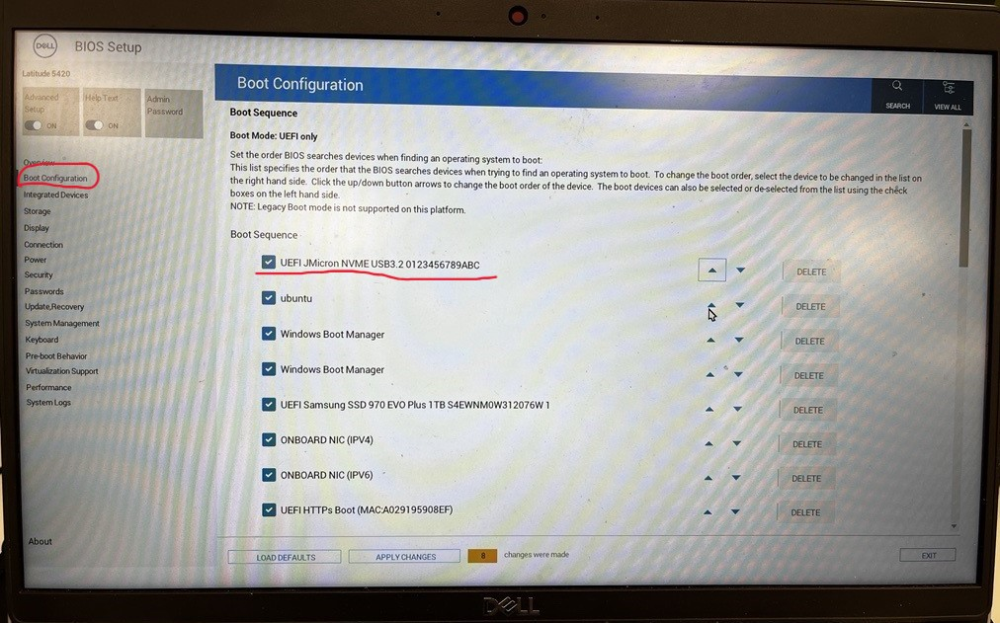

# Practical 1 Pre-Setup: Ubuntu Installation, Intro to Linux and Reference

## Assumed Background and Expectations
This course assumes that students are comfortable with:
- Basic programming (Python and/or C++)
- Using a terminal and command-line tools
- Editing configuration files
- Installing software using a package manager

You are not expected to be an expert Linux user at the start of the course. However, you are expected to be able to follow technical documentation independently and to troubleshoot basic setup issues. Setting up and maintaining a functional development environment is considered part of the learning outcomes of this module.

## Linux Installation 
From this point onward, Ubuntu 22.04 LTS is the reference operating system for this course. All practicals, examples, and troubleshooting assume this environment.

This choice reflects standard practice in robotics and aerial robotics research and industry. In particular, ROS 2 Humble and ROS 2-derived tools are most stable and best supported on Ubuntu 22.04.

In previous iterations of this course we explored Windows and macOS (including Intel and Apple Silicon). These platforms introduced persistent challenges, including:
- Compatibility issues with ROS 2 and its dependencies
- Inconsistent performance and tooling availability
- Increased troubleshooting overhead for both students and instructors

This ultimately reduced the quality and pace of the practical sessions. To maximise learning outcomes, the course now standardises on Ubuntu.

Specific to macOS users, we offered a limited laptop scheme (subject to availability and need). Please contact the course instructors for further details.

## Supported Setup Options (Order of Preference)

The following environments are supported, listed in order of preference:

1. Native Ubuntu 22.04 Installation (Strongly Recommended)
- Best performance and lowest latency
- Full support for:
  - ROS 2 Humble
  - Gazebo simulation
  - Aerostack2
  - USB-based hardware (e.g. Crazyradio)

This setup is strongly recommended for students intending to participate in hardware-based practicals and challenges.

2. Dual-Boot Ubuntu 22.04 (Supported)
- Ubuntu installed alongside an existing Windows installation
- Equivalent performance to a native installation when booted into Ubuntu
- Requires disk repartitioning and rebooting between operating systems
- Requires ≥ 100 GB of free disk space
- Ensure you have recorded your BitLocker account information to avoid issues!

Supported by course instructors.

3. Ubuntu 22.04 on an External SSD / NVMe Drive (Supported)
- Ubuntu installed on a portable USB-C SSD or NVMe drive
- Near-native performance
- Minimal changes to the host system
- Requires a fast USB-C port
- Ensure you have recorded your BitLocker account information to avoid issues!

A limited number of pre-configured Ubuntu 22.04 external drives may be available to borrow (subject to availability). Primarily tested on Windows systems; macOS compatibility is not guaranteed.

4. WSL 2 / Virtual Machines / Docker (Limited Support)

These options are permitted but not recommended. For those are the interested in exploring, we are happy to provide feedback. Though expect having to solve specific software and device related problems. For this keen to take up this challenge, it is a option for learning advanced aspects of using Linux for robotics development.

They may be suitable for:
- Learning Linux basics
- ROS 2 development
- Simulation-only work

Known limitations include:
- Unreliable USB access
- Increased latency and timing jitter
- Reduced graphics performance for Gazebo and RViz
- Additional configuration overhead

Support from the course team for these setups will be limited, and students using them may not be able to complete hardware-dependent activities.

While containers (e.g., Docker) and virtual machines (VMs) can offer flexibility, they have limitations in this context:
  - *Docker*: Known for portability, but graphical user interfaces (GUIs) for simulation tools like Gazebo and RViz can be challenging to configure, especially on Windows.
  - *Virtual Machines*: Simulations in Gazebo are graphics-intensive, and VMs often lack the hardware acceleration needed for smooth operation. Additionally, VMs can have limited access to host machine IO interfaces (e.g., USB), making hardware integration difficult.

That said, students are welcome to experiment with Docker or VMs, but these methods will receive minimal support from the course instructors.

## Installing Ubuntu 22.04
For native, dual-boot, or external-drive installations:

1. Download the Ubuntu 22.04 LTS Desktop ISO from:
- [Ubuntu ISO Download](https://ubuntu.com/download/desktop)
2. Prepare a bootable USB drive (8 GB minimum, 16 GB recommended) using a tool such as:
  - Rufus (Windows)
  - Balena Etcher
  - Ventoy
3. Insert the USB drive and reboot your machine.
4. Enter the boot menu or BIOS/UEFI settings (key varies by manufacturer; commonly F12, Esc, or Del).
- Example (Dell):
  - F2 → BIOS/UEFI
  - F12 → Boot menu
  - Go to bios setting to reorder your booting sequence.

Different brands of computers have different ways of getting into bios. For example, for dell computer, you could access the BIOS/UEFI settings by restarting your computer and pressing the F2 key repeatedly as soon as the Dell logo appears. Lift the borrowed drive up to the first, then save changes. Now your computer will boot from this automatically as long as it is plugged into your computer.  

5. Boot from the USB drive and follow the Ubuntu installer.
6. Choose to wipe the disk, dual-boot, or install to an external drive as appropriate.

Important:
Back up important data before installing or repartitioning disks. The course team cannot take responsibility for data loss due to OS installation. Also, for windows users, record and ensure you have access to your BitLocker account.

A general dual-boot guide can be found here:
[Dual-Boot Guide](https://www.onlogic.com/company/io-hub/how-to-dual-boot-windows-11-and-linux/)

## (Optional) WSL2 Installation
WSL 2 (Windows Subsystem for Linux) is permitted for this course with limitations. Based on our experience so far, it can be used for:
- Learning Linux and ROS 2
- Software development
- Simulation-only tasks

*It is not recommended for hardware-based practicals due to USB access complexity, latency, and non-deterministic timing.* Therefore, support for WSL 2 will be limited.

System Requirements:
- Windows 10 (version 2004 / build 19041 or later) or Windows 11
- Administrator access on your machine
- At least 16 GB system RAM recommended (8 GB minimum). By default, wsl2 allocates 50% of your systems resources. From our experience you need to set 24GB of memory to run the coursework.
- 
When using WSL2 expect:
- Increased latency compared to native Ubuntu
- Reduced stability at high ROS 2 update rates
- Gazebo performance may depend on compatible Windows vGPU drivers (you can force to run on CPU)
- No native USB access

USB devices (e.g. Crazyradio) require manual forwarding and may be unreliable.

1. Install WSL 2
Open PowerShell as Administrator and run:

```console
wsl --install
```

This will:
- Enable WSL
- Enable the Virtual Machine Platform
- Install WSL 2
- Install a default Linux distribution

Restart your machine when prompted.

To ensure WSL 2 is being used:

```console
wsl --set-default-version 2
```

2. Install Ubuntu 22.04
Install Ubuntu 22.04 explicitly:

```console
wsl --install -d Ubuntu-22.04
```

Once installed, launch Ubuntu from the Start Menu.

3. Update Ubuntu
Inside the WSL Ubuntu terminal:

```console
sudo apt update
sudo apt upgrade
```

Verify the version:

```console
lsb_release -a
```

You should see Ubuntu 22.04 LTS.

### Increasing WSL2 Memory and CPU allocation
By default, WSL 2 dynamically allocates system resources. For ROS 2 and Gazebo, this often results in insufficient memory and poor performance. To overcome, you must manually configure resource limits.

1. Create or Edit .wslconfig

- Open File Explorer
- Navigate to your Windows user directory:

```console
C:\Users\<your-username>\
```

Create a new text file named:
```console
.wslconfig
```
- Ensure the file has no file extension
- Windows may try to name it .wslconfig.txt (this is incorrect)

2. Configure Resource Limits
Open .wslconfig using Notepad or VS Code and paste the following:

```console
[wsl2]
memory=24GB
processors=20
swap=8GB
localhostForwarding=true
```
Above values are based on our experience, please adjust values based on your hardware. 

3. Restart WSL
```console
wsl --shutdown
```

4. Verify Resource Allocation
-In Ubuntu, check memory allocation:
```console
free -h
```

- Check processors:
```console
nproc
```

## Other Methods if you want to explore - Docker / Virtual Machine (Advanced and Limited Course Support)
The following options are not recommended as primary setups, but may be explored by students who are experienced with Linux systems and understand the associated limitations. Support from the course team for these methods will be limited.

1. Repurpose an old laptop
If you have access to an older laptop, you may choose to:
- Wipe the machine and install Ubuntu 22.04 directly
- Use it as a dedicated Linux development machine for the course

This approach can work well provided the hardware supports:
- Reasonable CPU performance
- At least 16 GB RAM
- Basic GPU acceleration for Gazebo

2. Docker
Docker may be useful in specific, controlled situations, but it is not a primary supported workflow for this module.

Known issues include:
    - Docker may be possible for some of the situations
    - Known issues with GUIs and Windows (which can be solved) 
    - Not as supported 
    
## Quick Linux Reference Guide

Adapted from this [digital ocean tutorial](https://www.digitalocean.com/community/tutorials/an-introduction-to-linux-basics). This section provides a concise, course-specific reference to Linux concepts and commands required for COMP0240. It is not intended to be a comprehensive Linux tutorial.

### What is Linux?
Linux is a family of free and open-source operating systems based on the Linux kernel (core operating system). Operating systems based on Linux are known as Linux distributions or distros. Examples include Debian, Ubuntu, Fedora, CentOS, Gentoo, Arch Linux, and many others.

The Linux kernel has been under active development since 1991, and has proven to be extremely versatile and adaptable. You can find computers that run Linux in a wide variety of contexts all over the world, from web servers to cell phones. Today, 90% of all cloud infrastructure and 74% of the world’s smartphones are powered by Linux.

However, newcomers to Linux may find it somewhat difficult to approach, as Linux filesystems have a different structure than those found on Windows or MacOS. Additionally, Linux-based operating systems depend heavily on working with the command line interface, while most personal computers rely on graphical interfaces.

### The Terminal

In Linux, most development and system interaction occurs via the terminal. The terms “terminal,” “shell,” and “command line interface” are often used interchangeably, but there are subtle differences between them:

* A **terminal** is an input and output environment that presents a text-only window running a shell.
* A **shell** is a program that exposes the computer’s operating system to a user or program. In Linux systems, the shell presented in a terminal is a command line interpreter. The default shell in Ubuntu Linux is known as `bash`.
* A **command line interface** is a user interface (managed by a command line interpreter program) which processes commands to a computer program and outputs the results.

When someone refers to one of these three terms in the context of Linux, they generally mean a terminal environment where you can run commands and see the results printed out to the terminal, such as this:


There are two ways to open a terminal:

1. Pressing the ++win++ or ++cmd++ key to open the program menu and typing `terminal`, then pressing ++enter++
2. Pressing ++ctrl+alt+t++

This default terminal is known as the 'gnome-terminal'. Other terminals exist such as ['terminator'](https://terminator-gtk3.readthedocs.io/en/latest/)


Becoming a Linux user requires you to be comfortable with using a terminal. Any administrative task, including file manipulation, package installation, and user management, can be accomplished through the terminal. The terminal is interactive: you specify commands to run (after the $ sign) and the terminal outputs the results of those commands. To execute any command, you type it into the prompt and press ++enter++.

Most ROS 2 workflows (building packages, launching nodes, sourcing environments) are executed from the terminal. Although personal computers that run Linux often come with the kind of graphical desktop environment familiar to most computer users, it is often more efficient or practical to perform certain tasks through commands entered into the terminal.

### Environment Variables and .bashrc
The shell uses environment variables to control how programs are found and executed.

For example, when you run a command, bash searches for the executable using the PATH variable:

```console
echo $PATH
```

A basic command to try out is `echo`, which will print things to the terminal. For example `echo hello-world` will print `hello-world` into the terminal. You can also use it to observe the value of **Environment Variables** which record and keep useful variables to the operation of the Operating System. For example, when you run a command in `bash`, `bash` will look for the command executable in the locations provided by the environment variable `PATH`. You can print the contents of this env-var using `echo $PATH`. The `$` before the name of the variable tells `bash` that the following word represents an environment variable, and that it should be looked up.

Note that for the default shell option of `bash`, there is often a way of specifying an environment (i.e. a set of variables, defaults etc) that your particular terminal shell interface is running. For bash, these defaults are defined inside of the `.bashrc` file found in your home directory. If we want defaults to be set, we add them in here - this becomes useful in many applications including ROS2. 

User-specific shell configuration is stored in:

```console
~/.bashrc
```

In this course, .bashrc is commonly used to:
- Source ROS 2 environments
- Set environment variables
- Configure development tools

After modifying .bashrc, apply changes with:

```console
source ~/.bashrc
```

### Navigating the file system

Like Windows and Mac, the Linux filesystems are based on a directory tree. This means that you can create directories (which are functionally identical to folders found in other operating systems) inside other directories, and files can exist in any directory.

The forward slash (`/`) is used to indicate the root directory in the filesystem hierarchy.

When a user logs in to the shell, they are brought to their own user directory, stored within `/home/<username>`. This is referred to as the user’s home directory. Often you may see the *tilde* (`~`) character when specifying a file location (e.g. `~/Documents/hello.txt` = `/home/<username>/Documents/hello.txt`). This is shorthand for the user's home directory and gets substituted in when used.

To see what directory you are currently active in you can run the `pwd` command, which stands for “print working directory”
```console
myuser@my-machine:~$ pwd
/home/myuser
```

To see a list of files and directories that exist in your current working directory, run the `ls` command:
```console
myuser@my-machine:~$ ls
 Desktop                    Documents
 Downloads                  Pictures
 Public                     Wallpapers
```
You can get more details if you run `ls -al` command:

```console
myuser@my-machine:~$ ls -al
drwxr-xr-x  2 myuser myuser   4096 Apr 30  2021  Desktop
drwxrwxr-x  8 myuser myuser   4096 Oct 29 09:27  Documents
drwxrwxr-x  8 myuser myuser   4096 Dec 10 14:41  Downloads
drwxrwxr-x  8 myuser myuser   4096 May 23 10:43  Pictures
drwxrwxr-x  8 myuser myuser   4096 Jan 19  2017  Public
drwxrwxr-x  8 myuser myuser   4096 Oct 15 09:43  Wallpapers
```

You can create one or more new directories within your current working directory with the `mkdir` command, which stands for “make directory”. For example, to create two new directories named testdir1 and testdir2, you might run the first command. You can create nested directories by using the `-p` option:
```console
myuser@my-machine:~$ mkdir testdir1 testdir2
myuser@my-machine:~$ mkdir -p testdir3/testsubdir
```

To navigate into one of these new directories, run the cd command (which stands for “change directory”) and specify the directory’s name:
```console
myuser@my-machine:~$ cd testdir1
myuser@my-machine:~/testdir1$
```

Note that you can navigate from anywhere to anywhere. `cd` only requires a valid filepath. Note also that `.` represents the current folder and `..` represents the parent folder. Note also how is shows the current working directory in the shell as well.
```bash
cd # This will bring you back to home directory
cd testdir3/testsubdir # Brings you into testsubdir
cd ../ # Brings you back out one level into testdir3
cd ../testdir1 # Brings you back out one level and back into testdir1
cd /home/<username>/testdir2 # Absolute reference to testdir2
cd ~/testdir2 # Absolute reference using tilde to testdir2
```

### Working with files
You cannot use cd to interact with files; cd stands for “change directory”, and only allows you to navigate directories. You can, however, create, edit, and view the contents of files.

One way to create a file is with the touch command. This creates an empty file in your current working directory. To create a new file called file.txt:
```bash
touch file.txt
```

If you decide to rename file.txt later on, you can do so with the mv command. mv stands for “move” and it can move a file or directory from one place to another. By specifying the original file, file.txt, you can “move” it to a new location in the current working directory, thereby renaming it.
```bash
mv file.txt newfile.txt
```

It is also possible to copy a file to a new location with the cp command. If we want to copy newfile.txt, you can make a copy of newfile.txt named newfile_copy.txt like this:
```bash
cp newfile.txt newfile_copy.txt
```

However, files are not of much use if they don’t contain anything. To edit files, a file editor is necessary.
There are many options for file editors, all created by professionals for daily use. Such editors include vim, emacs, nano, and pico.
`nano` is a suitable option for beginners: it is relatively user-friendly and doesn’t overload you with cryptic options or commands.
```bash
nano file.txt
```
This will open a space where you can start typing to edit the file. In `nano` specifically you can save your written text by pressing ++ctrl+x++, ++y++, and then ++enter++. This returns you to the shell with a newly saved `file.txt`.

Now that file.txt has some text within it, you can view it using `cat` or `less`.

The `cat` command prints the contents of a specified file to your system’s output. Try running `cat` and pass the `file.txt` file you just edited as an argument:
```bash
cat file.txt
```

Using `cat` to view file contents can be unwieldy and difficult to read if the file is particularly long. As an alternative, you can use the `less` command which will allow you to paginate the output. Use `less` to view the contents of the file.txt file, like this:
```bash
less file.txt
```
This will also print the contents of file.txt, but one terminal page at a time beginning at the start of the file. You can use the spacebar to advance a page, or the arrow keys to go up and down one line at a time. Press ++q++ to quit out of `less`.

Finally, to delete the file.txt file, pass the name of the file as an argument to `rm`:
```bash
rm file.txt              # delete a file
rmdir directory          # delete an empty directory
rm -r directory          # delete a non-empty directory (destructive)
```

> **NOTE**: If your question has to do with a specific Linux command, the manual pages offer detailed and insightful documentation for nearly every command. To see the `man` page for any command, pass the command’s name as an argument to the `man` command - `man command`.
> **Warning:** `rm -r` permanently deletes files and directories. Use with care.
> For instance, `man rm` displays the purpose of `rm`, how to use it, what options are available, examples of use, and more useful information.


> **NOTE**: If a command fails or is hanging or you just want to stop it, most of the time you can stop the running process by pressing ++ctrl+c++. This will send a Keyboard Interrupt message to the program and hopefully stop it.

### Installing Dependencies and Useful Programs

Like windows and mac, individual programs can be manually downloaded (usually as a `tar.gz` file instead of `exe`) and manually installed into your operating system (using `dpkg`). However, the linux project offers a much more straight forward method through the `apt` (Advanced Packaging Tool) utility. `apt` is a free-software user interface that works with core libraries to handle the installation and removal of software on Debian operating systems like Ubuntu. (For other distributions you may come across equivalents like `yum`). This is the primary method for installing software onto your system.

To use `apt`, and more specifically `apt-get` which 'gets' programs for you, you must first run the `update` command to get the current list of all available software. Note that because `sudo` is used, you will most likely need to input your password. `sudo` will be explained below.
```bash
sudo apt update
```
> **Note** that it will hang (stop responding) or fail if you are not connected to the internet.

#### Installing Git and VSCode

You can then install your programs using `apt install`. For this course, you will need to use the `git` version control software. To install `git`, run the following:
```bash
sudo apt install git
```

We also recommend the use of [Visual Studio Code](https://code.visualstudio.com/) as your development environment or text editor, but you are free to use whatever you want (atom, notepad++ etc etc). We heavily make use of it during development and recommend a number of extensions. VScode can be installed using the `snap` utility. `snap` is a slightly more modern successor to `apt` for more general programs. `snap` comes ready installed on your linux distrubtion.
```bash
sudo snap install code --classic
```

#### `sudo`
Now in these commands, we have prefixed all of them with `sudo`. `sudo` these days usually stands for `superuser do` and allows a command to be run with the privileges of the superuser (aka the *root* user), if the user has been given permissions to do so. Any command which installs or modifies directories outside of the users home directory will often need superuser privileges to avoid non-superusers from changing things they shouldn't. As the above commands all seek to install programs to the system, they need superuser permissions to do so. Running without `sudo` will give you a permission error. Running a command with `sudo` will ask you for your *own accounts* password.


#### Installing Docker

For Linux systems, see the following [install page](https://docs.docker.com/engine/install/ubuntu/). There are multiple ways of installation docker, but we recommend installing using the repository method:

1. Update the `apt` repository and install requirements

        sudo apt update

        sudo apt install \
            apt-transport-https \
            ca-certificates \
            curl \
            gnupg \
            lsb-release

2. Add Docker's official GPG key:

        curl -fsSL https://download.docker.com/linux/ubuntu/gpg | sudo gpg --dearmor -o /usr/share/keyrings/docker-archive-keyring.gpg

3. Add Docker's repository:

        echo \
        "deb [arch=$(dpkg --print-architecture) signed-by=/usr/share/keyrings/docker-archive-keyring.gpg] https://download.docker.com/linux/ubuntu \
        $(lsb_release -cs) stable" | sudo tee /etc/apt/sources.list.d/docker.list > /dev/null

4. Install Docker (and docker-compose!):

        sudo apt update
        sudo apt install docker-ce docker-ce-cli docker-compose containerd.io

5. Test Docker installation:

        sudo docker run hello-world

This will install Docker, accessible using `sudo` root privileges only. To use docker without sudo, run the following (there are [security issues](https://docs.docker.com/engine/install/linux-postinstall/#manage-docker-as-a-non-root-user))

1. Run the following

        sudo groupadd docker
        sudo usermod -aG docker $USER

2. Log out and log in again to enforce changes
3. Verify that it was successful (we will come back to this command):

        docker run hello-world

That is Docker on Linux installed. See [the original page](https://docs.docker.com/engine/install/ubuntu/) for any further details.

## Tasks

1. Install and Run Ubuntu 22.04 using a method described above
2. Familiarise yourself with Linux and Ubuntu
3. Install the programs and applications you might find useful
4. Install ROS2 and Gazebo Fortress

In week2 we will focus on installing Aerostack2.

*Further Tasks:*

1. Read the following to get the best introduction! [LinuxJourney](https://linuxjourney.com/)

## Common Linux Issues (Weeks 1–2)

The following issues are commonly encountered during the first two weeks:

### Permission Denied Errors
If a command fails due to permissions, check whether it requires `sudo`.

### Command Not Found
This usually indicates that the required package is not installed or that the environment has not been sourced correctly.

### Terminal Not Reflecting Changes
After editing `~/.bashrc`, always apply the changes using:
```bash
source ~/.bashrc

## Getting Help Effectively
Before asking for help, ensure you have:
- Read the error message carefully
- Checked the relevant section of this guide
- Attempted to search the error message verbatim

When requesting help, include:
- The full error output
- Your operating system and setup method
- The command you ran


   
