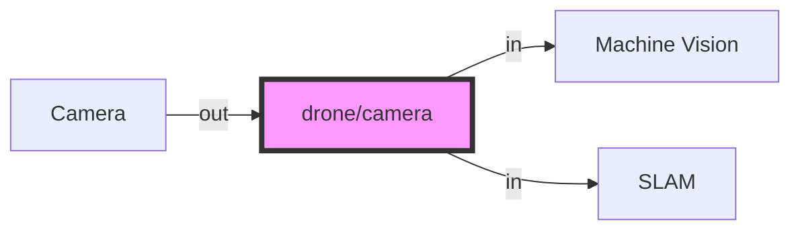
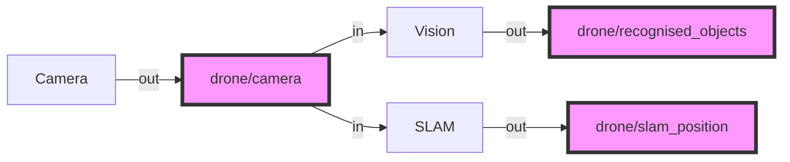

# Practical 1 Pre-Setup: ROS2 Installation, Intro to ROS2 and Development Workflow

This page introduces ROS 2 as a development and debugging workflow, not just a dependency to install. The objective is to ensure that you can build, run, inspect, and debug ROS 2 systems efficiently, which is essential for aerial robotics development.

The course uses ROS 2 Humble on Ubuntu 22.04

## Installation

### Installation ROS2 Humble

All instructions assume Ubuntu 22.04. If you are using WSL 2 or a virtualised environment, ensure this is configured correctly before proceeding.

For full installation details, refer to the official documentation:  
https://docs.ros.org/en/humble/Installation/Ubuntu-Install-Debs.html

Update your system:
```bash
sudo apt update
sudo apt upgrade
```

```bash
# Check and set the locale to UTF-8
locale
sudo apt update && sudo apt install locales
sudo locale-gen en_US en_US.UTF-8
sudo update-locale LC_ALL=en_US.UTF-8 LANG=en_US.UTF-8
export LANG=en_US.UTF-8
locale  # Verify settings
```

```bash
# Install required packages
sudo apt install software-properties-common
sudo add-apt-repository universe
sudo apt update
sudo apt install curl -y
```

```bash
# Download and add the ROS 2 GPG key
sudo curl -sSL https://raw.githubusercontent.com/ros/rosdistro/master/ros.key -o /usr/share/keyrings/ros-archive-keyring.gpg
```

```bash
# Add the ROS 2 repository to your sources list
echo "deb [arch=$(dpkg --print-architecture) signed-by=/usr/share/keyrings/ros-archive-keyring.gpg] http://packages.ros.org/ros2/ubuntu $(. /etc/os-release && echo $UBUNTU_CODENAME) main" | sudo tee /etc/apt/sources.list.d/ros2.list > /dev/null
```

You will need to install both the desktop and build tools
```bash
sudo apt install ros-humble-desktop
sudo apt install ros-dev-tools
```

### Environment Configuration - Source ROS2 Automatically
ROS 2 relies on environment setup. If this step is incorrect, ROS commands will not function. To do this, it is recommended that you add the startup script to your `~/.bashrc` script

- Open .bashrc and edit the file
```bash
nano ~/.bashrc 
```

The bashrc file should have been opened, then scroll to bottom of bashrc and append the following to the end, save (`Ctrl+O`) and exit (`Ctrl+X`)
```bash
source /opt/ros/humble/setup.bash
```

This will ensure that ROS2 is auto-enabled for all terminals which you setup. Ensure your system uses UTF-8, install the required packages, and add the official ROS 2 repository.

You can also edit .bashrc in the terminal without opening the file. This will add new entries to the bottom of the file.

-Restrict ROS communication to the local machine (recommended for teaching labs):
```console
echo 'export ROS_LOCALHOST_ONLY=1' >> ~/.bashrc
```

-Apply the changes:
```console
source ~/.bashrc
```

-Verify:
```console
ros2 --version
```
Expected output should reference humble.

> **Note**: In our tutorials please set `ROS_LOCALHOST_ONLY=1` otherwise everybody's ROS traffic will interfere with everybody else in the class! Outside of class we would usually segregate ROS traffic only its own network to avoid interference.

### Installing Ignition Gazebo Fortress

Gazebo is the simulation environment that is most often used with ROS2. There are many different versions of gazebo - for us we are using the new version designed for Ubuntu 22.04 known as Gazebo Fortress.

The recommended compatible gazebo version for Ubuntu 22.04 and Humble is Fortress where installation instructions are [here](https://gazebosim.org/docs/fortress/install_ubuntu). But in short:

```
sudo apt-get update
sudo apt-get install lsb-release wget gnupg

sudo wget https://packages.osrfoundation.org/gazebo.gpg -O /usr/share/keyrings/pkgs-osrf-archive-keyring.gpg
echo "deb [arch=$(dpkg --print-architecture) signed-by=/usr/share/keyrings/pkgs-osrf-archive-keyring.gpg] http://packages.osrfoundation.org/gazebo/ubuntu-stable $(lsb_release -cs) main" | sudo tee /etc/apt/sources.list.d/gazebo-stable.list > /dev/null
sudo apt-get update
sudo apt-get install ignition-fortress
```
You can check succesful installation by using the `ign` cli command


## A Brief Introduction to ROS

This section is adapted from [this article](https://dev.to/caelinsutch/a-brief-introduction-to-the-robot-operating-system-ros-15m5)

ROS stands for the Robot Operating System, yet it isn't an actual operating system. It's a framework designed to expedite the development time of robot platforms. To understand what ROS is, we should understand why ROS exists in the first place.

### Why does ROS exist?

In general, software developers avoid hardware like the plague. It's messy, doesn't have consistent behavior, and there's no ctrl-z in sight.

Most beginner programmers think you have to have a deep knowledge of electronics and even mechanics to program robots. They think that the hardware and software are so tightly coupled, you have to know both in depth to build anything useful.

Software developers became software developers for a reason, so they don't have to deal with hardware. For example, let's say you have to debug a faulty sensor. You first have to take out the sensor from the enclosure, test the sensor thoroughly with a multi meter and various test cases, document its behavior, then examine the hardware -level code to ensure that there were no bugs, and so on. That's a lot of interaction with the hardware that's not fun for someone who just wants to write some cool software.

It's harder to attract good programmers if the programming is coupled deeply with hardware. This is where ROS comes into play. With ROS, you can completely abstract the hardware from software, and instead interact with an API that gives access to that data. You can forget about the hardware, and focus on developing the software that makes the robot do what you want.

### What is ROS

ROS is essentially a framework that sits on top of an operating system which defines how particular ROS compatible programs communicate and share data with each other. Essentially ROS defines an interface between which compatible programs can communicate and interact with each other. Over the years that ROS has existed, many people have developed thousands of ROS compatible packages which can be used in a modular fashion.

### ROS concepts through an example

To make it more concrete, imagine that on your drone you have a camera. There are also two processes which require, as inputs, that camera image. Say, a machine learning program, and a position estimation program. Traditionally, you would have to manually serialise (compress) and stream the image over a port which the other two programs could read from. But if the port changes or, say, the camera changes, lots of things have to be reconfigured.

However, this sort of interaction can be made streamlined in ROS. Let us consider the programs we have as ROS **nodes**, i.e. a program which is responsible for one single modular purpose, with particular inputs or outputs:

1. A camera image streaming node
    - OUT: camera image
2. A machine vision system for recognising objects
    - IN: camera image
    - OUT: list of recognised objects
3. A simultaneous localisation and mapping system.
    - IN: camera image
    - OUT: vehicle position

These outputs of a node define ROS **topics**, i.e. a single stream of one type of data. Each topic has a particular name which can be referred to. In our example, some of the topics might be:

- `/drone/camera` for the camera image
- `/drone/recognised_objects` for the machine vision system
- `/drone/slam_position` for the SLAM system

Then, we see that there are two avenues of communication created from these node inputs and outputs.



Now ROS follows a **publisher/subscriber** model of communication. What that means is that nodes **publish** data to `topics` as outputs. But that data is only sent across the network if a different nodes also **subscribes** to the same topic. So in our example we end up having

1. A camera image streaming node
    - OUT: publishing to `/drone/camera`
2. A machine vision system for recognising objects
    - IN: subscribed to `/drone/camera`
    - OUT: publishing to `/drone/recognised_objects`
3. A simultaneous localisation and mapping system.
    - IN: subscribed to `/drone/camera`
    - OUT: publishing to `/drone/slam_position`



Finally, the data that is sent is not just anything. The data or **message** is a specifically templated packet of data containing things specified for that paricular use case. In our example for `/drone/slam_position` topic, the message might be of type [`geometry_msgs/msg/Point.msg`](https://github.com/ros2/common_interfaces/blob/master/geometry_msgs/msg/Point.msg) which is defined like so:
```
# This contains the position of a point in free space
float64 x
float64 y
float64 z
```
In other words the message that the `/drone/slam_position` topic publishes must have a `msg.x`, `msg.y` and `msg.z` field, and the subscriber will only receivea message with those fields. There are a number of messages in the standard ROS library, but many libraries also define their own - as have we in some parts of Starling.

This can be summarised in this diagram from the [ROS tutorials](https://docs.ros.org/en/foxy/Tutorials/Understanding-ROS2-Nodes.html) demonstrates it very nicely:


The bottom half of this shows how topics get sent from a publisher to a subscriber.

Interestingly, if you put two topics together, you get some notion of two way communication. This is the basis of a **service** which can be seen in the top of the diagram. A **service** is made of a Request topic and a Response topic, but functions as a single communication type to the user. Similar to messages, a service has a defined request and response types (e.g. see [`std_srvs/srv/SetBool.srv`](https://github.com/ros2/common_interfaces/blob/master/std_srvs/srv/SetBool.srv)).  A service request will often wait until a response is received before continuing.

Then if you combine two services and a topic, you can imitate a request for something which takes time. This in ROS is known as an **action**. For example requesting a robot to move from one location to another. You first request the move, which you get a response as to whether its started. This is followed by constant feedback along a particular topic. Then ended with a task complete service response. In this a whole set of messages are defined.  

Note that everything happens asyncronously and in parallel, when a node subscribes or sends a requests, it doesn't know when the response will arrive. It only knows it will (hopefully) arrive at some point. When a packet is received the subscriber can then run a method - this method is usually known as a **callback**, but that will be covered in a later tutorial.

Finally, each node is configured by a set of **parameters** which are broadcast to all other nodes. Parameters are often configuration values for particular methods in a node, and can sometimes be changed on startup (or dynamically through a service), to allow the node to provide adjustable functionality. For example the value of a timeout or frequency of a loop.

So in summary, the key concepts and terminology are:

- **Nodes**
- **Topics**
- **Publishers and Subscribers**
- **Messages**
- **Services**
- **Actions**
- **Parameters**

### ROS2 vs ROS1

There are 2 versions of ROS: ROS1 and ROS2. ROS1, initially created in 2007 by Willow Garage, has become huge among the open source robotics community. However over the years they realised that there are a number of important features which are missing - and adding all of these would simply break ROS1. Also the most recent ROS1 distribution (ROS Noetic) is soon to reach the end of its supported life (EOL 2025) with no more ROS1 there after! (See [this article](https://roboticsbackend.com/ros1-vs-ros2-practical-overview/#Why_ROS2_and_not_keep_ROS1) for more details!)

Therefore, to future proof the system, and to ensure all users get a well rounded experience that will hopefully translate to industry experience, Starling has been implemented in ROS2. Specifically, this tutorial uses the **Humble Hawksbill** (AKA Humble) Long Term Support (LTS) distribution throughout.

There are some interesting changes between ROS1 and ROS2, but the core elements described above remain identical. For those interested, ROS2 follows a much more decentralised paradigm, and does not require a central ROSnode as it uses the distributed DDS communication protocol for its internal communication. All nodes therefore broadcast their own topics allowing for easy decentralised discovery - perfect for multi-robot applications.

> **Note:** Main thing to be aware of is if you are debugging and searching for ROS questions on the internet, be aware that there are many existing questions for ROS1 which will no longer apply for ROS2.

### About Gazebo

Gazebo Fortress is a powerful and widely used open-source robotics simulation tool that allows developers and researchers to test, design, and validate their robots in virtual environments before deploying them in the real world. It provides a highly realistic simulation environment, complete with accurate physics, sensor emulation, and 3D visualization. Gazebo Fortress is the latest release in the Gazebo simulation suite, offering enhanced features such as improved physics engines, better integration with ROS2, and support for multi-robot systems. Students can use Gazebo to simulate everything from autonomous drones navigating complex environments to robotic arms performing precision tasks, all without the risk of damaging physical hardware. One of its standout features is the ability to create custom worlds and robots, making it a versatile tool for exploring robotics concepts and conducting experiments. Gazebo’s tight integration with ROS2 also allows students to seamlessly test ROS2-based algorithms and systems within the simulator, bridging the gap between virtual testing and real-world implementation.

Technically, Gazebo operates as a standalone simulation engine but shares key concepts with ROS2, including the use of the **publish-subscribe architecture**. In Gazebo, simulation components such as sensors, robots, and environmental factors communicate through topics, similar to ROS2 nodes. This allows for seamless integration between ROS2 and Gazebo, where ROS2 nodes can subscribe to Gazebo topics (e.g., sensor data) or publish commands (e.g., velocity or actuator inputs). The system we use in this course makes heavy use of Gazebo as the simulation platform for drone activities to enable development. It will not be likely that you will interact with Gazebo direcly, and instead through a ROS2 interface, however having some context is useful! 

## Tasks

1. Install ROS2 as instructed above
2. Familiarise yourself with ROS2 (note the differences if you have previously used ROS1)
3. Do some of the ROS2 tutorials [here](https://docs.ros.org/en/humble/Tutorials.html) 
