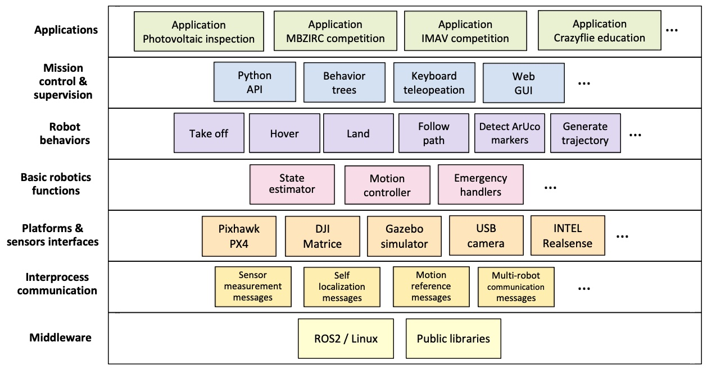

# Practical 2: Introduction to Aerostack2 Framework For Aerial Robotic Systems  

[TOC]

Aerostack2 is the **primary aerial robotics platform** used throughout this module. It provides a complete, research-grade framework for developing, simulating, and deploying aerial robotic systems using ROS 2.

At this stage of the course, the goal is early exposure and installation.

You are **not expected** to:
- Understand every component of Aerostack2
- Modify low-level controllers or behaviours
- Debug complex multi-node launch issues

Instead, the objectives of this session are to:
- Understand *why* a framework like Aerostack2 is needed
- See how a full aerial robotics stack is structured
- Successfully **run an existing Aerostack2 project**
- Gain confidence interacting with the platform at a high level

Aerostack2 will be revisited later in the module, where you will progressively take more responsibility for mission design, autonomy, and system configuration.

## Aerostack2 Practical Basics 
Aerostack2 should be understood as a **layered system**, built on top of ROS 2, rather than as a monolithic or “black-magic” framework.

The key layers are:

### 1. Hardware / Simulation Layer
This is the physical or simulated platform:
- Real drones (e.g. Crazyflie, PX4-based platforms)
- Gazebo for simulation

This layer is responsible for:
- Physics
- Sensors
- Actuators

### 2. ROS 2 Middleware Layer
ROS 2 provides the communication backbone:
- Nodes
- Topics
- Services
- Actions

All Aerostack2 components are ultimately ROS 2 nodes communicating through standard ROS 2 interfaces.

### 3. Aerostack2 Core Libraries
This layer provides reusable aerial robotics functionality:
- State estimation
- Motion control
- Behaviours (e.g. takeoff, land, go-to)
- Safety and emergency handling

These are **generic**, reusable components that are independent of any specific application.

### 4. Aerostack2 Project Repository (Application Layer)
This is where a specific application is defined.

A project repository:
- Selects which Aerostack2 components are used
- Configures how they are launched
- Defines missions using Python scripts

Examples include:
- Gazebo simulation projects
- Indoor flight projects
- Outdoor autonomous missions

### 5. User Mission Logic 
At the top level are:
- Python mission scripts
- High-level commands (takeoff, move, land)
- Mission sequencing

**In this practical, you will only interact with this top layer.**

Understanding this separation is critical:  
you can design and test aerial missions **without modifying the underlying flight stack**.

---

## Tasks: Running Aerostack2 in Black-Box Mode

In this practical, you will treat Aerostack2 as a **black-box system**:
you will run it, observe it, and interact with it — but not modify its internals.

### Task 1 – Clone the Aerostack2 Source Repository

**Goal:** Ensure you have the Aerostack2 source code locally.

- Create or use an existing ROS 2 workspace
- Clone the Aerostack2 repository into the `src` directory
- Install dependencies and build the workspace following the provided instructions

---

### Task 2 – Run an Existing Aerostack2 Example

**Goal:** Verify that you can launch a complete aerial robotics system.

- Navigate to the example project (e.g. Project Gazebo)
- Launch the simulation using the provided scripts
- Start the ground station and the simulated drone

---

### Task 3 – Observe the Running System Using ROS 2 Tools

**Goal:** Connect Aerostack2 back to core ROS 2 concepts.

While the system is running:
- List active ROS 2 nodes
- List active topics
- Identify which topics are likely related to:
  - State estimation
  - Control commands
  - Mission execution

You are not expected to understand everything — focus on recognising structure.

---

### Task 4 – Mini Challenge: Execute a Simple Mission

**Goal:** Interact with Aerostack2 at the mission level.

Choose **one** of the following challenges:

**Option A – Mission Execution**
- Run an existing example mission script
- Observe the sequence of actions (e.g. takeoff → move → land)
- Identify where in the code the mission logic lives

**Option B – Mission Modification**
- Duplicate an existing mission script
- Change **one simple parameter** (e.g. altitude, duration, waypoint)
- Rerun the mission and observe the difference

Do **not** modify configuration files or launch scripts.

---

## Background to Robotic Frameworks For Aerial Control

As robotic and autonomous systems proliferate into the wider world, there is a need to address the difficulties of system development and deployment at scale. There is evidence that industry is directly facing these challenges through the use of cloud computing, continuous integration and similar systems inspired from very successful and agile software development processes. This is made clear through offerings such as Amazon's [AWS Robomaker](https://aws.amazon.com/robomaker/), Google's cloud robotics and so on.

However, there is a great lack of such systems in most academic settings. The result's oriented attitude of many labs often leads to each researcher building a bespoke solution in order to evaluate, validate or prove their goals. These bespoke solutions are often inflexible, not extensible, difficult to understand and, importantly, reuse, with any level of confidence. This becomes especially difficult when coupled with hardware, such as UAVs, where many operational details have been implicitly assumed or ignored for favour of getting the experiment running as quick as possible. In addition these solutions are often poorly structured and maintained  with little to no documentation meaning that it is difficult for researchers to build upon these systems. This is an exceptionally large hurdle to researchers who do not have strong software backgrounds, but wish to perform real world experiments which could improve the quality of research outputs.

This is not to say that it is impossible for a research system to be developed into a reusable platform. There are many examples of research systems being ubiquitous within a group or being released outside the lab. For instance, the [Robotarium at Georgia Tech](https://www.robotarium.gatech.edu/), the Multi-Robot Systems Group at the Czech Technical University with their [experimental system](https://github.com/ctu-mrs/mrs_uav_system), and the PX4 autopilot which began its life as a collaboration between a number of labs at ETH Zurich. But what we see is that it takes a concerted effort and many years of coincidental work which provide incremental improvements to the system each time. Previously I had attempted to develop a system which solved this problem called [starling](https://github.com/StarlingUAS/ProjectStarling) which had a number of flaws. 

Therefore as an example system for you to learn, we have chosen the **aerostack2** as our aerial robotic systems development platform. This will enable the following:

1. Supports single or multiple drones with low (control) or high level (path planning) experimentation.
2. Supports the transition between simulation to indoor flight to outdoor flight.
3. Provides a simple and easy to use interface for researchers to implement experimentation without knowledge of hardware specifics.

We hope that through using aerostack2, you develop an overview of the components required in an aerial system, and gain experiences which can then be applied to whatever systems you work with in the future.  

## [Aerostack2](https://aerostack2.github.io/index.html) 

- [Link To Documentation](https://aerostack2.github.io/index.html)
- [Link To Github](https://github.com/aerostack2/aerostack2?tab=readme-ov-file)

> UCL fork of aerostack2: [Github](https://github.com/UCL-MSC-RAI-COMP0240/aerostack2)

### Overview 

Aerostack2 (AS2) is an open source software framework that helps developers design and build the control architecture of aerial robotic systems, integrating multiple heterogeneous computational solutions (e.g., computer vision algorithms, motion controllers, self-localization and mapping methods, motion planning algorithms, etc.), built for ROS 2 Humble.

Aerostack2 is useful for building autonomous aerial systems in complex and dynamic environments and it is also a useful research tool for aerial robotics to test new algorithms and architectures.

It was created to be available for communities of researchers and developers and it is currently an active open-source project with periodic software releases.

Aerostack2 is versatile for building different system configurations with various degrees of autonomy. It’s most important features are:

  - From teleoperation to autonomous flight. Aerostack2 can be used for teleoperation flights (with manual control) but it can also be used for building autonomous robot systems to perform aerial missions without operator assistance.  
  - Single robots or multi-robot systems. Aerostack2 can be used to fly a swarm of heterogeneous drones to perform multi-aerial-robot missions. It has been validated to operate with several drones simultaneously, both in indoor and outdoor environments.  
  - Flexible for different applications. Aerostack2 can be used by system designers to develop their own systems in a wide range of applications. Aerostack2 provides languages and graphical tools to configure specific aerial missions.  
  - Hardware independent. Aerostack2 runs on conventional laptops and it has also run on onboard computers like Nvidia Jetson NX. Aerostack2 has been used in different aerial platforms, including, but not limited to: DJI platforms (Matrice 210RTKv2, Matrice 300, Ryze Tello), Pixhawk autopilots and Crazyflie drones. The framework can operate in simulation and in a real environment in a similar way, what simplifies the Sim2Real development. 
  - Complete modularity, allowing elements to be changed or interchanged without affecting the rest of the system. Plugin-based architecture allows to use different implementations for every tasks.  
  - Project-oriented, allowing to install and use only the necessary packages and configurations for the application to be developed

### Using Aerostack2

In practice, a Aerostack ROS2 working project comprises of two parts:

1. The Core Aerostack Libraries
    - This provides the core ROS2 nodes, functionalities and interfaces and will be described in more detail below. It is simply another ROS2 library like any other. 
2. An Aerostack2 Project Repository (Application)
    - This is a project folder which interacts and manages a specific application you want to develop with aerostack2. This contains a number of scripts, as well as the python api interface scripts for easy implementation of applications. 

### Core Aerostack Libraries

Aerostack2 provides existing implementations of, and methods of extending key parts of a flight control stack. This includes:

1. **Support of different vehicle platforms** - both real drone platforms such as a crazyflie or PX4 and also gazebo for simulation 
2. **Robotic Functions** - essential software components and algorithms essential for aerial robotics functionality such as 
    - State Estimation (External Source, Ground Truth, Motion Capture)
    - Motion Control (PID, Differential Flatness)
    - Emergency Handling 
3. **Behaviours** - Individual built-in components that implement specific high level robotic functionalities such as the following. This allows a mission plan to be expressed as a sequence of activated behaviours in series or in parallel. A key aspect of behaviours is that each individually has state defining whether a behaviour can be activated, if it is still performing that behaviour, deactivating the behaviour and so on. 
    - Motion Control (e.g. Taking Off, Landing, Go_to )
    - Perception (e.g. Detect Marker, Record Video, Control Gimbal)
    - Planning (e.g. Trajectory Generation)
4. **Mission Control** - Highest level user facing components for designing and implementing missions of behaviours. 
    - Behaviour Trees 
    - Python API
    - Mission Monitoring (Rviz)

See [this page for more details](https://aerostack2.github.io/_01_aerostack2_concepts/architecture/index.html)

The core libraries can be installed for `apt-get` if no changes are necessary. However in this course, we will be building from scratch as it allows us to make quick fixes versions within our repository ([UCL AS2 REPO](https://github.com/UCL-MSC-RAI-COMP0240/aerostack2)). To install aerostack, you create a new ROS2 workspace and clone our aerostack into the src folder, download dependencies, and build as usual 

See [these instructions](https://aerostack2.github.io/_00_getting_started/source_install.html)

We will be diving further into a specific example in the next article. 

### Project Repository

The mission control elements of aerostack2 combined with ROS2 allow a high degree of separation between the core libraries and any application specific code. This is great because it means that the core of aerostack is application agnostic, allowing it to be applied to various different specific applications. The specific application then comes in the form of its own repository which is in charge of specifying which nodes are to be run, and in what configuration for a particular use case. A python script can then be used to run the core mission logic, invoking behaviours and telling the drone what to do and when. 

AS2 developers have built up a recommended pattern of usage for invoking and using aerostack2 functionality. This primarily revolves around the use of the linux command line, bash scripts and a tool called `tmux`.  

1. Tmux is a 'terminal multiplexer' which allows the operation of multiple terminals simultaneously from within the same window. Combined with the `tmuxinator` tool which can define configurations of tmux windows, tmux serves to run all of the many ROS2 nodes. This makes things easier as we would ordinarly need to manual start, or replaces a standard ROS2 launch file whilst making monitoring easier in these larger complex systems. 
2. A launch bash script, often called `launch_as2.bash` is then used to spin up all of the ROS2 nodes representing a single drone by managing the various environment variables and runtime options, and then invoking tmux. A second bash script is used to represent the ground station `launch_ground_station.bash` which launches central processes such as visualisation, motion capture, rosbag recording or other external data sources. 
3. Finally a mission can be defined in python using AS2's python API and the ROS2 API. Then either from within the drone or ground station tmux, this mission can be started. 

Lets take a look at the [project gazebo](https://github.com/aerostack2/project_gazebo) example project for working with gazebo - all of the simulation based projects are based on this repository. 

- [Project Gazebo](https://github.com/aerostack2/project_gazebo)

All projects in aerostack2 are structured in the same way. The project is divided into the following directories:

- **tmuxinator**: Contains the tmuxinator launch file, which is used to launch all aerostack2 nodes.
  - **aerostack2.yaml**: Tmuxinator launch file for each drone. The list of nodes to be launched is defined here.
  - **ground_station.yaml**: Tmuxinator launch file for the ground station. The list of nodes to be launched is defined here.
- **config**: Contains the configuration files for the launchers of the nodes in the drones.
- **config_ground_station**: Contains the configuration files for the launchers of the nodes in the ground station.
- **launch_as2.bash**: Script to launch nodes defined in *tmuxinator/aerostack2.yaml*.
- **launch_ground_station.bash**: Script to launch nodes defined in *tmuxinator/ground_station.yaml*.
- **mission_\*.py**: Different python mission files that can be executed.
- **stop.bash**: Script to stop all nodes launched by *launch_as2.bash* and *launch_ground_station.bash*.
- **rosbag/record_rosbag.bash**: Script to record a rosbag. Can be modified to record only the topics that are needed.
- **trees\***: Contains the behavior trees that can be executed. They can be selected in the *aerostack2.yaml* file.
- **utils**: Contains utils scripts for launchers.

Both python and bash scripts have a help message that can be displayed by running the script with the `-h` option. For example, `./launch_as2.bash -h` will display the help message for the `launch_as2.bash` script.

> Note: Whilst this is the main template, the different projects will have variants depending on their needs and therefore might look and contain slightly different things. 

We will go into more details of usage instructions in the next article, but here is the link to how to run this example: [Link](https://aerostack2.github.io/_02_examples/gazebo/project_gazebo/index.html)

