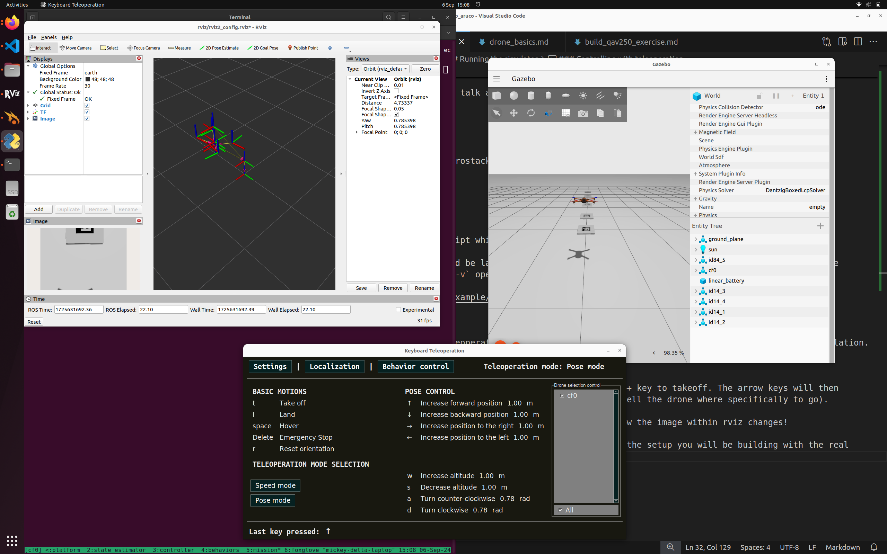

# Practical 3: Mini Challange - ROS2 with Aerostack2

This practical builds upon the previous introduction to **Aerostack2** as the main aerial robotics framework used in this module and provides hands-on experience running it in simulation using Gazebo and ROS2.

By this point in the course, you should already be comfortable with:
- ROS2 workspaces, nodes, and topics
- Building and sourcing ROS2 projects
- Launching and inspecting Gazebo simulations

The goal of this practical is to gain confidence using Aerostack2. You are **not expected** to:
- Understand all Aerostack2 internals
- Modify low-level controllers or behaviours
- Debug complex configuration or launch issues

[TOC]

> **NOTE:** If you run into any issues, create an issue on the github repository: [project_gazebo_aruco](https://github.com/UCL-MSC-RAI-COMP0240/project_gazebo_aruco)

## Mini-Challenge 

In this simulation mini-challenge, we have setup a small project in which there are a number of aruco codes in a line in front of the drone. There are only two types of aruco code arranged such that for n codes in a line, the first n-1 will be of type 1, and the nth will be type 2. 

Your task is to write an algorithm which can detect aruco markers from the drones camera, and fly forward until you reach the type 2 code, and land on it. 

In order to do this, you must be able to first have installed Aerostack2 and the project code. You will then need to have understood how the mission script works and how to subscribe and process the drone stream. Finally you will need to work out how to control the drone from the drone stream. 

## Aerostack2 Installation

No matter how you run the linux system, you can try each of the following two options (Local or Docker).

### Local Installation 
#### Setup and build Aerostack2 (we use version 1.1.2)
In your home directory (could be anywhere else but all the paths below are for your home directory)

```
mkdir -p ~/project_gazebo_ws/src
cd ~/project_gazebo_ws/src
git clone https://github.com/UCL-MSC-RAI-COMP0240/aerostack2.git
```

> Make sure you clone *our* `UCL-MSC-RAI-COMP0240` fork of aerostack2 - a fork is a fancy name for a copy of the original repository but still remains connected - such that if the original developers ever update their version, we can decide to also pull in the new updates. But it remains separate such that we can also add our own updates for you. 

This will create a ros2 workspace and place the aerostack2 repository in it.

> You can see that aerostack2 itself is made up of many different ros nodes and packages. 

You will need to install the dependencies by running the following:

```bash
sudo apt install git python3-rosdep python3-pip python3-colcon-common-extensions tmux tmuxinator -y
pip3 install pysimplegui-4-foss
```

And then going back into the root workspace to install the remaining ROS2 dependencies automatically. 
```bash
cd ~/project_gazebo_ws
sudo rosdep init
rosdep update
rosdep install -y -r -q --from-paths src --ignore-src
```

Then, enable the handy aerostack2 cli (only run this once)

```bash
echo 'export AEROSTACK2_PATH=$HOME/project_gazebo_ws/src/aerostack2' >> $HOME/.bashrc
echo 'source $AEROSTACK2_PATH/as2_cli/setup_env.bash' >> $HOME/.bashrc
source ~/.bashrc
```

This will enable you to build the project from any folder using

> It will take a couple of minutes as it builds all of aerostack2!

```
as2 build
```

Now as2 should be installed.

Finally add the following to your bashrc

```bash
echo 'source $HOME/project_gazebo_ws/install/setup.bash' >> $HOME/.bashrc
source ~/.bashrc
```


#### Setup this project

Get this project locally

```bash
mkdir -p ~/project_gazebo_ws/src
cd ~/project_gazebo_ws/src
git clone https://github.com/UCL-MSC-RAI-COMP0240/project_gazebo_aruco.git
```

Run the example using 

```bash
cd ~/project_gazebo_ws/src/project_gazebo_aruco
./launch_as2.bash -s -t
```

<!--
### Docker

*If you have locally installed this project already, you can elect not to do this section. Otherwise you could give it a go if you usually run a different version of ubuntu.*

Ensure Docker or Docker Desktop is installed on your machine

First your will need to clone this project somewhere (doesn't need to be in a ros2 workspace)

```bash
git clone https://github.com/UCL-MSC-RAI-COMP0240/project_gazebo_aruco.git
```

To build and/or run the container run the script

This container is based on Ubuntu 22.04, ROS2 Humble and Ignition Gazebo Fortress

```bash
./docker/docker_start.bash
```

After building for a while, this will drop you inside the docker container.

The container will have live mounted this project into `/ros2/project_gazebo_aruco` so that any changes made to this repository outside of the container will be reflected inside. 

Inside the container, navigate to that repository and run the example.

```bash
cd /ros2/project_gazebo_aruco
./launch_as2.bash -s -t
```

> Note that you can utilise a GPU if you install the `nvidia-container-toolkit`. Pass the `-nvidia` argument to `docker_start.bash`

-->

## Running the simulator

In your selected environment, start the aerostack2 simulation environment 

```bash
cd ~/project_gazebo_ws/src/project_gazebo_aruco
# or docker: cd /ros2/project_gazebo_aruco
./launch_as2.bash -s -t -v
```

The `launch_as2.bash` file runs a bash script which controls what elements are also started up. 

> The `-s` indicates that the system should be launched in simulation mode. The `-t` opens up the teleoperation remote control window to control the drone. The `-v` opens up a visualisation software called rviz2. You can have a look at `-h` for all of the different options, some won't be relevant for this task. 


### What does the simulator run

The aerostack simulator runs a number of different modules for ensuring successful flight this includes:

- Platform Interface
- State Estimation
- Motion Controllers
- Behaviour Controllers (Takeoff, Land, Go-To)

You can see the status of these other modules if you select the terminal and press ++ctrl+b++ and then press ++0++ ... ++5++ to change windows. In a single window you can switch between panes by pressing ++ctrl+b++ and then a direction arrow. 

<!-- > This terminal environment is called `tmux` and you can use these keyboard shortcuts to navigate. Look for tmux cheatsheet if you want to know more commands.  -->

### A quick aside on Tmux

This fancy terminal environment you find yourself in is known as `tmux`.

Tmux is a way for to allow terminal users to run and view multiple programs at the same time - in the case for us, multiple ROS2 nodes doing different things. Here they are organised in windows and panes. 

I would recommend reading through a guide such as the following, and just trying it out! 

- [https://hamvocke.com/blog/a-quick-and-easy-guide-to-tmux/](https://hamvocke.com/blog/a-quick-and-easy-guide-to-tmux/)

The useful feature for us is that you can define configuration files for running a bunch of different programs - especially useful for complex systems with multiple components to spin up, but also observe (observation being one of the main issues with ros launch files). 

### Controlling with teleoperation

Using the `-t` option will open up the teleoperation panel, allowing you to attempt to manually fly the robot in simulation. 


With the teleoperation panel clicked on and selected, you can press the ++t++ key to takeoff. The arrow keys will then control the direction of flight of the drone in position control mode (you tell the drone where specifically to go). 

Notice how the drone flies around in the simulation and in rviz. Also see how the image within rviz changes! 

The image is from a bottom mounted camera on the simulated drone, mirroring the setup you will be building with the real drone. 

Play around a fly the drone around! 



### Running the example autonomous mission

In the original terminal (Use ++ctrl+b++ + ++5++ ), we can run any scripts we want. The `mission_*.py` scripts are some examples of these autonomous missions. 

To run one of these examples, in the terminal type:

```
python3 mission_camera.py
```

This example mission gives you a camera stream from the drone, takes off and arms the drone and flies it around using a few different methods.

Key points is the use of ROS2 to subscribe to the camera topic published by the drone model. Whenever an image is received, it will run the `img_callback` function. 

### Stopping the simulator 

In order to stop the simulator cleanly, in any terminal run the `./stop.bash` script. 

```
./stop.bash
```

This will stop all containers and relevant programs to the simulator in a clean manner. 

Sometimes the simulated drone will go into an unrecoverable state - you may need to resart the simulator. 


## Dissecting the controller

Here is the example controller. It is documented! 

```python
#!/bin/python3

"""
CAMERA SAMPLE MISSION

This file is an example mission which reads from the aerostack drone camera and prints it to screen

It also flies around using position and velocity control camera topic 
"""

# Imports
import time
import rclpy
import argparse
from as2_python_api.drone_interface import DroneInterface

from rclpy.qos import qos_profile_sensor_data
from sensor_msgs.msg import Image, CameraInfo

from cv_bridge import CvBridge
import cv2 

######## Drone Control Class ###################
class DroneMotionRef(DroneInterface):
    """Drone Interface
    
    This is the aerostack2 drone interface for connecting to simulated and real drones. 

    It runs as a ROS2 Node which interacts with the currently available ROS2 topics.
    It defines the variables that represent a single drone, i.e.
    - Platform Information
    - Vehicle Pose and Twist (angular velocity)
    - Functions to control the hardware of the drone (arm, disarm, change mode, estop)

    It also contains some modules for flying the drone, this includes:
    - Takeoff, Landing (self.takeoff, self.land)
    - GoTo position control (self.go_to) [https://github.com/aerostack2/aerostack2/blob/main/as2_python_api/as2_python_api/modules/go_to_module.py]
    - FollowPath module (self.follow_path) [https://github.com/aerostack2/aerostack2/blob/main/as2_python_api/as2_python_api/modules/follow_path_module.py]
    
    Other module exist which could be used to. Their interfaces and functions can be referenced most easily in the code. 

    Some Documentation is here: https://aerostack2.github.io/_09_development/_api_documentation/temp_ws/src/as2_python_api/docs/source/as2_python_api.html 
    The Source Code is here: https://github.com/aerostack2/aerostack2/tree/main/as2_python_api 

    Drone Interface Base.py: https://github.com/aerostack2/aerostack2/blob/main/as2_python_api/as2_python_api/drone_interface_base.py 
    Drone Interface.py: https://github.com/aerostack2/aerostack2/blob/main/as2_python_api/as2_python_api/drone_interface.py
    """

    def __init__(self, name, verbose=False, use_sim_time=False):
        super().__init__(name, verbose, use_sim_time)

        # ROS2 create a subscription to the raw image of the sensors.
        # This details the ros message type (Image), the name of the topic
        # And the function that should be called when a message is received on this topic
        self.create_subscription(Image, "sensor_measurements/hd_camera/image_raw", self.img_callback, qos_profile_sensor_data)

        # CV Bridge is a set of functions to convert to and from ROS images to Opencv images
        self.br = CvBridge()

    def img_callback(self, data):
        """Image Callback Function

        The image message is defined here: https://github.com/ros2/common_interfaces/blob/rolling/sensor_msgs/msg/Image.msg 

        Args:
            data (sensor_msgs.msg.Image): The received image message 
        """
        self.get_logger().info('Receiving video frame', once=True) # Log Once

        # Convert the image message to a Opencv image frame
        current_frame = self.br.imgmsg_to_cv2(data)

        # Show the frame in a window
        cv2.imshow("camera", current_frame)   
        cv2.waitKey(1) # Wait a millisecond 

    def run_test(self):
        """ Run the mission """

        # Set the drone to offboard mode. This prepares the drone to receive
        # commands from outside of the flight controller. 
        self.offboard()
        self.get_logger().info("Offboard Mode")

        # Arming the drone powers up the motors to prepare for flight
        self.arm()
        self.get_logger().info("Armed!")

        # Takeoff to 1 meter
        self.get_logger().info("Taking Off!")
        res = self.takeoff(height=1.0, speed=0.5)
        if res:
            self.get_logger().info("Take off complete")
        else:
            self.get_logger().info("Take off Failed, exiting")
            return
        
        # Wait a little bit
        time.sleep(1.0)

        # Position Control fly around a bit
        speed = 1.5
        self.go_to.go_to_point([1, 0, 1.0], speed=speed)
        self.get_logger().info("Point 1")
        self.go_to.go_to_point([2, 0, 2.0], speed=speed)
        self.get_logger().info("Point 2")
        self.go_to.go_to_point([3, 0, 3.0], speed=speed)
        self.get_logger().info("Point 3")
        self.go_to.go_to(3.0, -1.0, 2.5, speed=speed)
        self.get_logger().info("Point 4")
        self.go_to.go_to_point_with_yaw([4, 1, 3.0], angle=45.0, speed=speed)
        self.get_logger().info("Point 5")
        self.go_to.go_to_point_with_yaw([3, -2, 2.0], angle=-45.0, speed=speed)
        self.get_logger().info("Point 6")
        self.go_to.go_to_point_with_yaw([0, 0, 1.0], angle=0.0, speed=speed)
        self.get_logger().info("Point 7")

        self.land()

############# Running the mission and Entrypoint #################################
if __name__ == '__main__':
    parser = argparse.ArgumentParser(
    description="Starts camera mission")
    parser.add_argument('-s', '--simulated',
                        action='store_true', default=False)
    parser.add_argument('-n', '--drone_name', default="cf0")
    args = parser.parse_args()

    if args.simulated:
        print("Mission running in simulation mode")
    else:
        print("Mission running in real mode")

    # Starts ROS2 Node in a script
    rclpy.init()

    # Create the drone object. Connects to the real/simulated drone and runs tests
    uav = DroneMotionRef(args.drone_name, verbose=True)

    # Runs the UAV TEST function
    uav.run_test()

    # Shuts down the UAV
    uav.shutdown()

    # Stop ROS2 Node
    rclpy.shutdown()

    print("Clean exit")
    exit(0)

```


## Modifying the controller

Now try and modify this controller by making it go to different places at different speeds.

This would be a good time to try an automate any computer vision or detection algorithms inside this python script. 

Finally, remind yourself of the goal of this mini-challenge, and try to implement a solution! 

> In this simulation mini-challenge, we have setup a small project in which there are a number of aruco codes in a line in front of the drone. There are only two types of aruco code arranged such that for n codes in a line, the first n-1 will be of type 1, and the nth will be type 2. Your task is to write an algorithm which can detect aruco markers from the drones camera, and fly forward until you reach the type 2 code, and land on it. 

> Note: Pay attention to the grid sizes of the ArUco markers and the maximum ID number that the detection algorithm can handle. Check the ID numbers of the simulated markers (found in the model file in the src folder) and determine your ArUco dictionary setup strategy accordingly. Here is a quick tutorial on ArUco markers on OpenCV: https://docs.opencv.org/4.x/d5/dae/tutorial_aruco_detection.html. 
 

> Note: you likely do not need to restart the entire simulation every time you test your script (unless you crash out or put the drone/system into an unrecoverable state). Simply make your change and re-run the script! (Although you may want a script to send the drone back to the starting pose!)

<!-- ## Transferring this controller

To transfer this controller to real drone, all that is needed is to copy this python mission file to the running machine.  -->

## Tasks

1. Install project gazebo aruco as instructed
    - Whats the differences between this project and project gazebo?

2. Run Project Gazebo with the teleoperation panel and rviz2 for the camera feed
    - Where is the camera feed coming from? 
    - What is the purpose of rviz2 and what does it show you? 

3. Run Project Gazebo with the example mission camera script
    - How does the script get the camera data? 

4. Implement and test and aruco detection method using OpenCV 
    - What version of aruco marker are we using? 

5. With the aruco detection, implement a controller which can solve the mini-challenge

*Further Tasks:*

1. The generated world is defined in `sim_config/world.json`, with models defined in the `models` directory. Have a play around with the world 
    - What other tasks could you do with your aruco detection module? 
