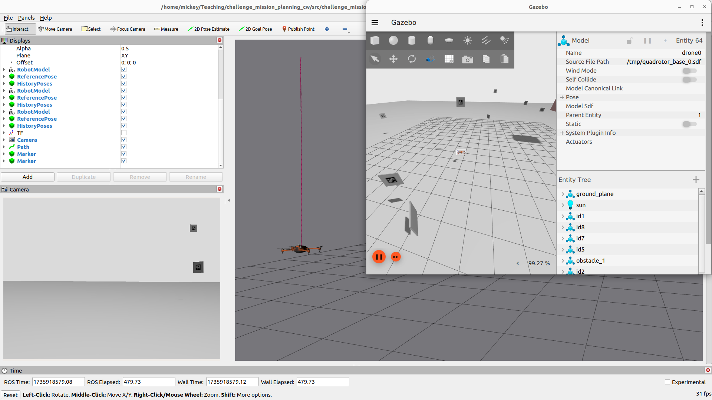

# Coursework 1 Challenge: Structural Inspection Path Planning

## Challenge 

You have the challenge of solving the problem of finding the most optimal way of visiting a series of locations and taking pictures of markers, while avoiding the obstacles in the environment. This mirrors real life autonomous inspection scenarios which are the majority of current day use cases with autonomous drones. 

### Structural Inspection Path Planning 

The structural inspection path planning problem is often broken down into three different problems

1. 3D Viewpoint generation, in which a 2.5D or CAD model of the structure is used to determine the optimal set of camera positions which need to be visited in order to generate enough data for a reconstruction. 
2. [This Challenge] Coverage Path Planning / Tour Optimisation & Trajectory Generation, then tries to find the optimal ordering of viewpoints to visit, potentially including the optimal trajectory itself. This often attempts to minimise time, travel distance, energy or other factors. 
3. Trajectory Following & Control is then the lower level controller which attempts to follow the calculated optimal coverage path as close as possible in order to capture the images in a location as close as specified. 

> For further information on structural inspection path planning, see [this article](https://www.autonomousrobotslab.com/structural-inspection-path-planning.html)

### Your Challenge

In this challenge we focus on the second step of finding the optimal route around a set of viewpoints. 

You will be given a *scenario* which specifies:

1. The drone starting location
2. The position and orientation (pose) of each of the viewpoints which you are being requested to visit
3. The location of cuboid shaped obstacles to avoid 

A set of scenarios have been given within the `scenarios` folder for you to use for development and testing. 

Your challenge will be in implementing and comparing a set of methods for controlling a drone to fly around the viewpoints, verifying that all of the specified aruco targets have been seen and visited, whilst avoiding the obstacles. You will need to consider the following:

- Optimal routing and finding a solution to the path planning problem 
- Motion planning and how to route from one viewpoint to another to avoid collisions while preserving energy
- Logging to ensure that your solution has collected "data" and visited every target to proove completion to a potential client. 
- Calculation of relevant metrics (time, distance, speed, etc) for comparison of various methods.

### Interesting things to look up to get you started

- Travelling Salesman Problem
- Combinatorial Optimisation 
- Complete routing graph of all the connectivity of the viewpoints
- Consider the value of the weight on each edge on the routing graph
- Dubins Paths 
- Visualise your paths, maps and routes
- Python Libraries:
  - scipy
  - numpy
  - python_tsp
  - networkx
  - matplotlib

## Challenge Environment

// TODO

The repository is here: [challenge_mission_planning](https://github.com/UCL-MSC-RAI-COMP0240/challenge_mission_planning/tree/main)