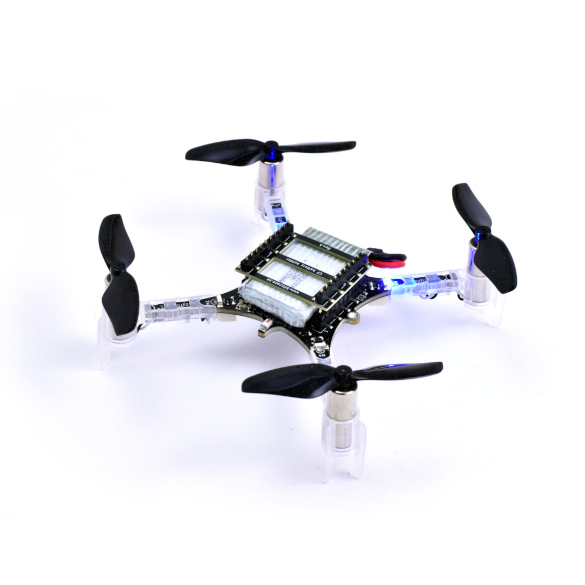

# Practical 3 & 4:  Building and flying Crazyflies

In this third and fourth practical we are jumping in and getting hands on with flying crazyflies - manually and hopefully if we're lucky autonomously doing simple things. 

[TOC]

## Crazyflies

### What are Crazyflies

The Crazyflie 2.1+. is a versatile open source micro-drone flying development platform that only weighs 27g and fits in the palm of your hand. 

Checkout their website to learn more about them 
- https://www.bitcraze.io/ 

You will see that they are used for R&D activities all over as its a perfect platform for learning, researching and experimenting with all things drones and drone swarms in a lab setting. 

### Why are we using them

Inspired by aerial robotics courses from other institutions, we utilise the crazyflie as an initial teaching platform due to:

- Ease of use
- Size & Safety
- Programmability 
- Large Community

Through using them, you will learn the basics of constructing a drone platform and how the various physical components fit together. This includes the drone itself but also how you might communicate with a drone through the radio. 

The crazyflie comes with a nice cross-platform user interface for connecting to, configuring and monitoring a drone. This interface allows you to connect a game pad for manual flight of the crazyflie, but also there is an andriod and IOS app for manual flying of the drone over bluetooth. 

Bitcraze and various research groups have released a lot of open source, freely available code for programming the drone in python and c++, with many examples. This allows you to more easily implement and experiment with different methods of autonomy for the drone. 

Finally due to the small size, there is very little chance of injury (**PROVIDING YOU ARE WEARING YOUR SAFETY GLASSES**) when flying, even if you do collide with something or someone. This makes it ideal for use during a tutorial with many people in a classroom setting. As you will see later, flying with anything larger will require flying within our dedicated flying arena. 

## Safety

### Personal Safety

- **WEAR YOUR SAFETY GLASSES AT ALL TIMES DURING THIS PRACTICAL**
- It is recommended to wear long sleves and trousers
- When the drone is flying, it should always be watched

### Battery Safety

- **The Drones use small Lithium-Polymer batteries and as such we must be careful** 

- **DO NOT DROP, PIERCE, HAMMER OR OTHERWISE DAMAGE THE BATTERIES** 

- **IF A BATTERY LOOKS DAMAGED DO NOT USE IT AND TELL A STAFF MEMBER**

- **IF A BATTERY STARTS SMOKING OR IS ON FIRE TELL THE STAFF AND CALMLY MOVE AWAY FROM IT**

> We will have a metal sand bucket and long tongs and the battery will go in there 

- **DO NOT ATTEMPT TO PUT OUT THE FIRE YOURSELF** 

## Practical Tasks

The following are tasks for you to hopefully solve and achieve throughout this session. Consider these questions when you do the next few tutorials. 

### Preliminary Tasks

1. **Get and put on your safety glasses**
2. Sign out a single crazyflie and associated parts
3. Clear out a designated 2x2m ish flying space 

### Main Tasks

1. Build the crazyflie
3. What are the different sensors and when should each one be used? 
4. Setup the software and crazy radio and connect your crazyflie
    - Can you see the live sensor feed? 
5. Can you perform manual flight with your phone or game controller
    - **WATCH OUT - SMALL INPUTS NEEDED OTHERWISE IT WILL HIT THE CEILING / OTHER PEOPLE**
    - How does the crazyflie respond to your controls - is it sluggish? fast to react? 
    - How stable is the drone? 
    - Do you think this is a good way to control a drone? 
6. Using the crazyflie python library, write a simple script which (1) takesoff the drone, (2) flies to another point (3) lands
    - What are the commands needed to achieve takeoff? 
    - How accurate is the drones takeoff height? 
    - How well does it fly to the other point, can you characterise it? 
    - How good is the landing? 
    - How repeatable is the flight? 
7. Now make the drone do something interesting
    - e.g. Fly a more interesting pattern? Perform an experiment to find the accuracy of the system? 
