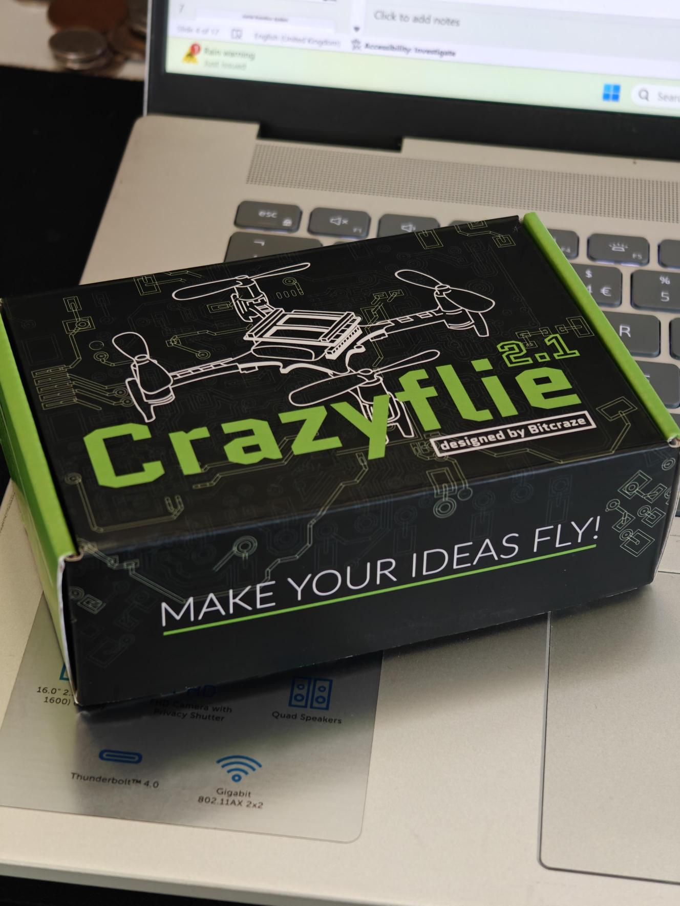
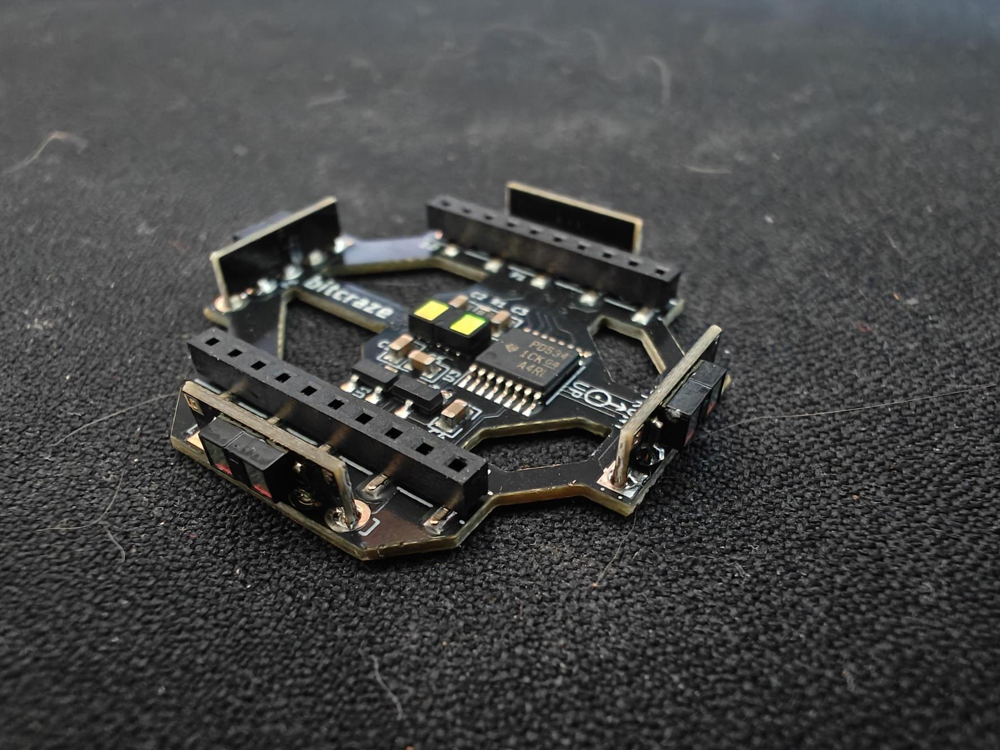
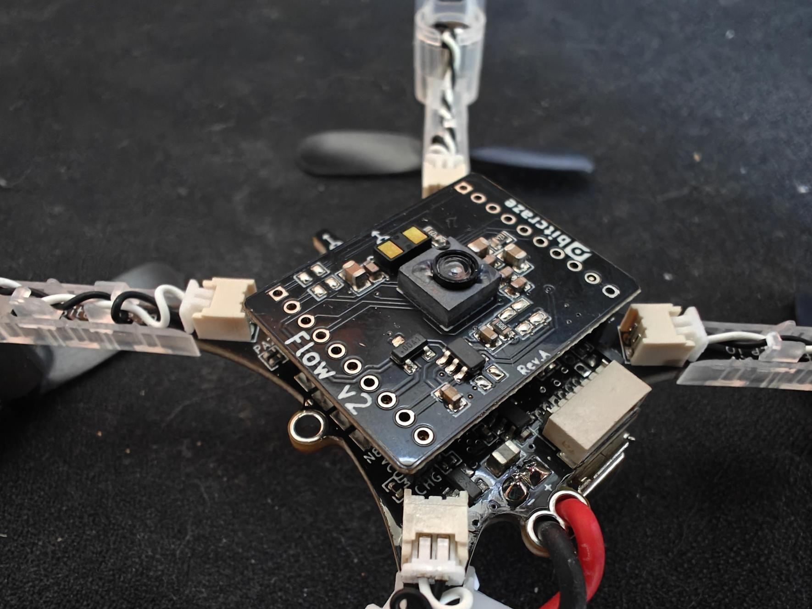
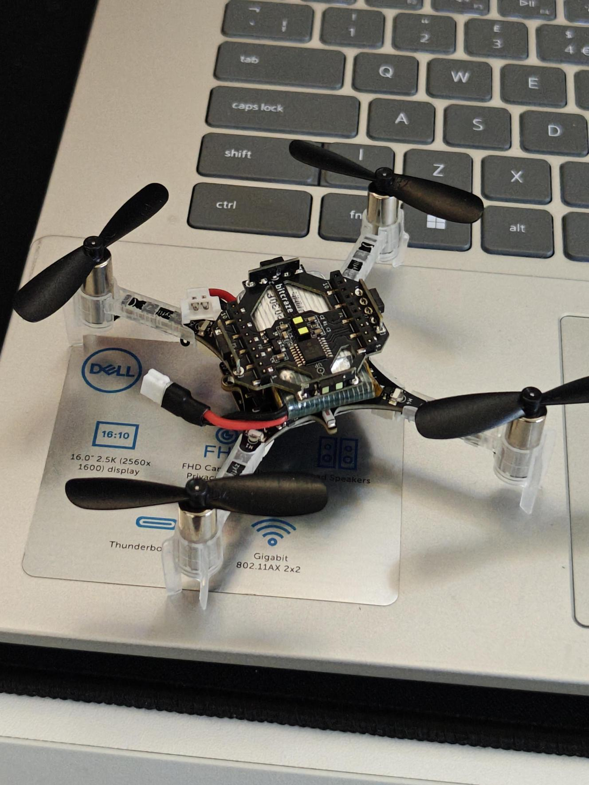

# Practical 3: Crazyflie Build and Installation

[TOC]

## Build

The first step is to unbox your crazyflie kit and build your crazyflie! 

To take you through the unboxing and first time setup, let us follow Bitcraze's own introductory tutorial which will hopefully get you to the state of flying!

Come back when you have finished bench testing and are ready to fly

### Crazyflie Build

> Notes: Be gentle with the parts - the crazyflie is hardy but the connectors might not be! We have small tools you can borrow if needed.

> **Do not fly yet!**

- [https://www.bitcraze.io/documentation/tutorials/getting-started-with-crazyflie-2-x/](https://www.bitcraze.io/documentation/tutorials/getting-started-with-crazyflie-2-x/)

To understand more about the GUI and to connect up a controller see:

- [https://www.bitcraze.io/documentation/repository/crazyflie-clients-python/master/userguides/userguide_client/](https://www.bitcraze.io/documentation/repository/crazyflie-clients-python/master/userguides/userguide_client/)

### Connect External Sensors

Not included in the tutorials above are the rangefinder and flow v2 sensor decks.

The crazyflie has a very limited ability to stably fly without external sensing of some descring. As it is right now, the drone will likely drift away very quickly and will be difficult to control. 

To solve this, we will be using the rangefinder and Flow v2 sensor decks from crazyflie for external sensing. The flow v2 sensor deck uses a camera on the bottom to perform optical flow to enable the drone to sense horizontal motion. It also has a downwards facing rangefinder for vertical stabilisation. The rangfinder deck then contains a number of ranging units for the other 5 directions. If the crazyflie detects the prescence of these decks, it will automatically use them to stabilse. 

More information on their operation is in the next tutorial. 

Rangefinder:

Flow V2 Sensor:

To see pictures and instructions for the mounting see the following:

- [https://www.bitcraze.io/documentation/tutorials/getting-started-with-stem-ranging-bundle/](https://www.bitcraze.io/documentation/tutorials/getting-started-with-stem-ranging-bundle/)

> **Double check that your boards are on the correct way around (notice the arrows)**

## Next Steps

Congratulations you have hopefully now built a working crazyflie which is ready to fly and hover in place. 

**NOTE: you must notify an instructor to check your crazyflie before you should fly** 

Go onto the next tutorial for instructions for manual and autonomous flying. 
