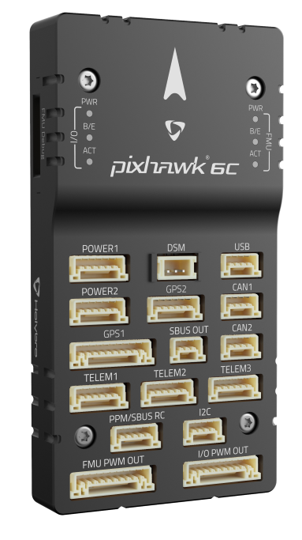
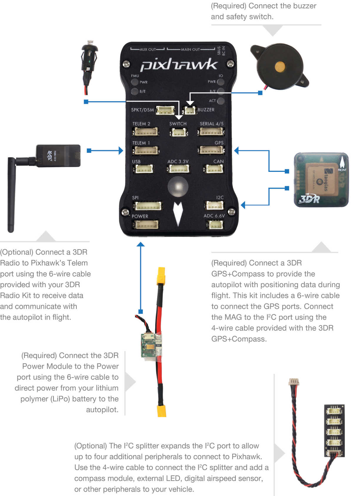
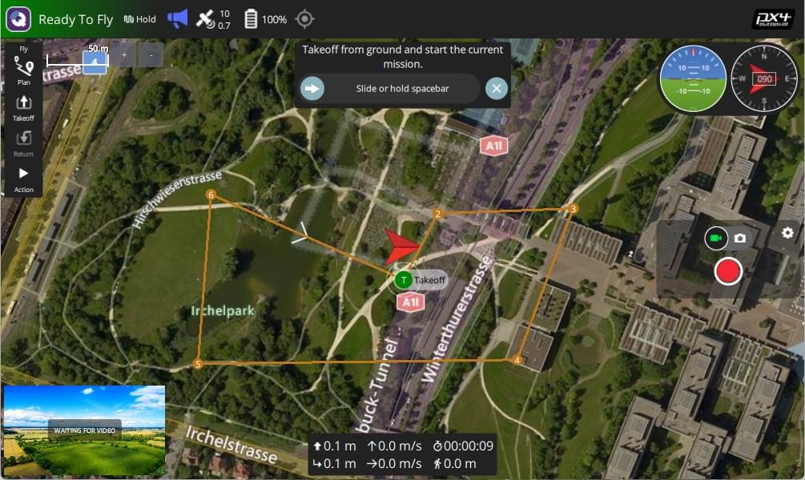
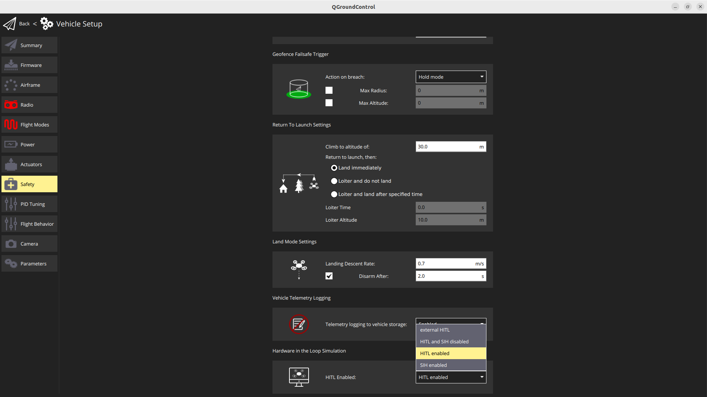
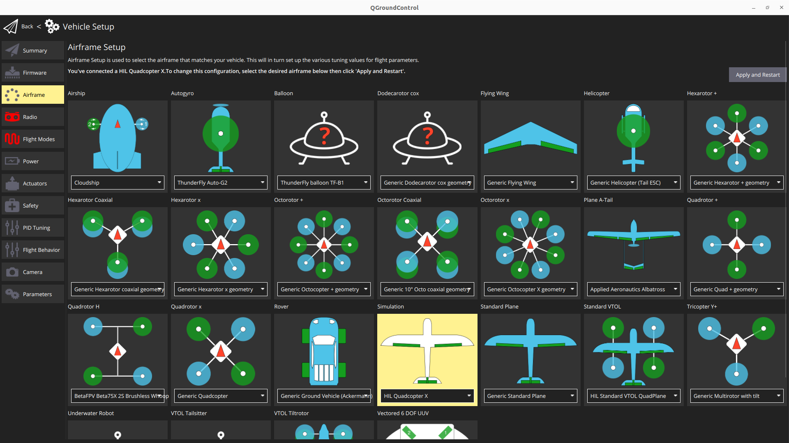
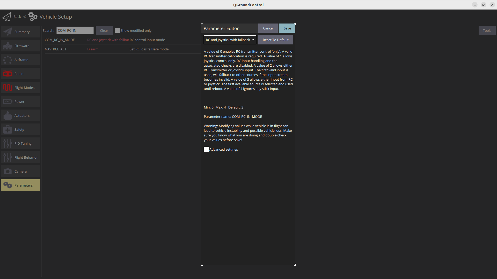
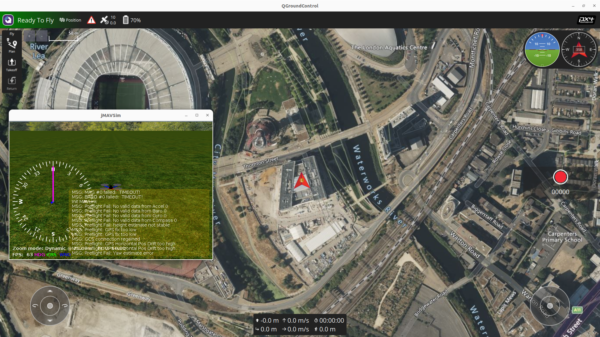

# Practical 6: Pixhawk and PX4, Commercial and R&D Autonomous Drone Systems

[TOC]

## Overview
Pixhawk and PX4 are widely used in autonomous drone development, providing an open-source hardware and software ecosystem for UAV control. In this tutorial, we will introduce:

- **Pixhawk**: The hardware autopilot platform
- **PX4**: The open-source flight control firmware
- **How to set up and use PX4 with Pixhawk**
- **PX4 Hardware In The Loop (HITL) Testing**
- **Creating Missions with QGC**

This will help you transition from Crazyflies and Aerostack2 to more advanced UAV platforms.

## What is Pixhawk?

Pixhawk is a family of open-source flight controllers developed for UAVs and robotics applications. It provides:

- High-performance **autopilot capabilities**
- **Multiple sensor support** (GPS, IMUs, barometers, etc.)
- **Compatibility** with PX4 and ArduPilot firmware
- Connectivity options like **UART, I2C, CAN, MAVLink and DDS**

### Common Pixhawk Versions:

- **Pixhawk 4**: Standard for academic and research use
- **Pixhawk 6X**: More advanced processing capabilities
- **Pixhawk 6C**: Compact version with strong processing power
- **Pixhawk Mini**: Compact version for small UAVs

### How to use a Pixhawk

This is the pixhawk 6c you will be playing around with, see all of the ports for various inputs




This following wiring diagram is from an older pixhawk model, but should show the key elements of connecting up and powering a pixhawk 



## Flight Control Firmware

There is no universal controller design of converting from user inputs to motor thrust. In the same way, there are numerous other functionalities that an autopilot can cover. These can range from running control loops for gimbals, cameras and other actuation, to high level mission following and safety features. These functionalities are bundled into specific autopilot *firmwares* which each offer a slightly different set of features, as well as differing user interfaces each with their advantages and drawbacks.

The two current most common autopilot firmware's in use in research settings are [Ardupilot](https://ardupilot.org/copter/index.html) which offers the Arducopter firmware, and [PX4](https://px4.io/) which offers Multicopter firmware. Both these firmwares are very extensive and cover numerous use cases. However, for our purposes we will only cover enabling autonomous flight through observing the *mode* of the autpilot.

Both Ardupilot and PX4 use the concept of flight modes, where each mode operates a supports different levels or types of flight stabilisation and/or autonomous functions. Traditionally this is for pilots to change between different controller layouts for different applications. It's necessary to change to the correct mode for safe and controllable flight. The following table shows the most often used flight modes within Starling.

| [Ardupilot Mode](https://ardupilot.org/copter/docs/flight-modes.html) 	| [PX4 Mode](https://docs.px4.io/v1.12/en/getting_started/flight_modes.html)  	| Functionality                                                                                 	|
|----------------	|-----------	|-----------------------------------------------------------------------------------------------	|
| stabilized     	| manual    	| Full manual control with RC sticks being sent directly to control roll, pitch, yaw and height 	|
| PosHold        	| position  	| UAV uses onboard sensing to stay in place, RC sticks used to translate position               	|
| loiter         	| auto.hold 	| Automatic mode where UAV stays in the same location until further instructions given.         	|
| land           	| auto.land 	| Automatic mode which attempts to land the UAV                                                 	|
| Guided         	| offboard  	| Navigates to setpoints sent to it by ground control or companion computer                     	|


As mentioned before, the base purpose of the firmware is to provide a given cascading PID controller for converting high level commands to motor thrusts. However both firmwares provide a plethora of other functionality from trajecotry following, basic mission following, telemetry and communications and many others too. 

As a controller developer, it is also useful to understand the differences between the Ardupilot and PX4 controllers and what real world impacts that has. In most of drone targeted applications we only require either position or velocity control which works fairly consistently between the two firmwares. 

In our own work, it has generally been noted that Ardupilot seems to be more suitable for outdoor flight, and PX4 for indoor flight. For this tutorial we will be developing a controller for indoor multi-vehicle flight and so we will assume the use of PX4. The biggest difference is actual in licensing where Ardupilot's license specifies that any developments must be contributed back, however PX4 is a bit more free allowing the forking and commercialisation without needing the announce or contribution (although this is not necessarily the best for the longevity of this open source project!). 

## PX4 Software Stack

PX4 consists of:

1. **PX4 Firmware** - The core flight control software
2. **QGroundControl (QGC)** - GUI for setup and mission planning
3. **MAVSDK (or other communication method)** - API for developing drone applications
4. **Hardware-In-The-Loop (HITL)** - Using real Pixhawk hardware for simulation or **Software-In-The-Loop (SITL)** for using simulated drones for testing. 


### Autopilot communication

Once in guided or offboard mode, the autopilot by default expects communications using the [MAVLINK protocol](https://mavlink.io/en/messages/common.html). Traditionally this would have been used for a ground control station (GCS) to send commands to a UAV over a telemetry link. However, now it has also developed into a protocol for commanding the autopilot from an onboard companion computer over a USB or serial connection too. The MAVLink protocol is a set of preset commands which compatible firmwares understand and react to. In this tutorial we will primarily be observing the mavlink interface, but we will not get into writing your own software with mavlink yet.

With the growing prevelance of ROS2, all of the major firmwares have attempted to provide direct communication using ROS2's underlying communication/middleware protocol of DDS (Data Distribution Service). Although we will not cover this in this module, this is what we currently use to communication between a companion computer and the pixhawk for drone work. 

Note however that even if DDS is enabled, autopilots will still send Mavlink messages down a *Telemetry* stream - often a dedicated low bandwidth communication channel for the monitoring of the drones health and status. 

### Ground Stations 

A key element of any drone operation is a competent and reliable ground station setup. The purpose of the ground station is to provide a reliable communication link with the drone and receive telemetry to be able to keep an eye on, and monitor the status of the drone. Often this is done via a second *telemtry* radio operating on a different frequency - in our case an SIK radio on 433Mhz - with one end connected to the drone, and the other connected via USB to a laptop or computer (or handheld games console like the steam deck). 

There are a number of choices for a piece of software which runs on the ground station. In industry, you may see Alterion or other softwares which provide an interface. In the open source world we either use *mission planner* with Ardupilot or *QGroundContrl* with PX4. In this tutorial we will trying to use **QGroundControl** (QGC). 




Tools like QGC are crucial for real-time **flight monitoring, control, and mission planning**. It allows users to:

- **Monitor telemetry data** (battery levels, GPS status, IMU readings, etc.).
- **Send flight commands** such as takeoff, landing, and mission execution.
- **Configure drone parameters** including PID tuning, sensor calibrations, and failsafe settings.
- **Visualize the drone's location** and trajectory on a map interface.
- **Log and analyze flight data** to debug issues or optimize performance.

Ground stations are useful as they enable:

- **Safety**: Enables real-time monitoring, preventing potential failures.
- **Ease of Use**: Provides a user-friendly interface to interact with the drone.
- **Flexibility**: Supports different flight modes (manual, autonomous, guided, etc.).
- **Data Logging**: Essential for post-flight analysis, AI training, and debugging.
- **Remote Control**: Operate the drone without requiring direct physical interaction.

## Setting Up Pixhawk with PX4 and QGroundControl

Now lets setup your pixhawk with PX4, connect to it and do some initial calibrations with QGC. 

### Setup Overview

1. Install **QGroundControl (QGC)** ([Download](https://qgroundcontrol.com/))
2. Flash **PX4 firmware** onto Pixhawk via QGC
3. Configure **sensors and RC calibration**
4. Use *QGC* to setup some automated flights
5. (Not today) Setup **offboard control** (for AI/robotics integration)


### Install QGroundControl

Follow the following instructions for all platforms:

- [https://docs.qgroundcontrol.com/master/en/qgc-user-guide/getting_started/quick_start.html](https://docs.qgroundcontrol.com/master/en/qgc-user-guide/getting_started/quick_start.html)

### Power up and connect the Pixhawk

Tidly unbox the pixhawk box in a way that you can put everything back later! For this tutorial, all you will need is:

- Pixhawk
- USB-C cable

Plug the USB-C cable from the Pixhawk to a port in your laptop

Now start QGroundControl

In the top left it will hopefully automatically pick up the pixhawk and you can start browsing the settings and seeing the live view. 

See [https://docs.qgroundcontrol.com/master/en/qgc-user-guide/getting_started/quick_start.html](https://docs.qgroundcontrol.com/master/en/qgc-user-guide/getting_started/quick_start.html) for how to navigate and use QGC.

### Flashing the Pixhawk

The first step for us is to flash the latest PX4 version onto the pixhawk. This can be done easily from within QGC. 

Follow the following instruction page:

- [https://docs.qgroundcontrol.com/master/en/qgc-user-guide/setup_view/firmware.html](https://docs.qgroundcontrol.com/master/en/qgc-user-guide/setup_view/firmware.html)


### Sensor Calibration 

The next step would be to perform sensor calibration in order to calibrate the onboard accelerometer and gyroscope. In the setup menu go to the sensors tab and follow the instructions. 

> Of course in practice you would perform the calibration after having built the drone, but this will do for now!

### Continue Setup

Scroll through the other setup steps, there are a number that we are skipping in this session, but in practice you would have to usually complete:

- **Radio Setup**: It's standard to have a radio connected with both a receiver connected to the pixhawk and a transmitter with the dedicated pilot. The radio is important in order to have a backup method of controlling the drone, as well enabling mode switching between various manual flight regimes and offboard mode. Important for safety too as having a emergency stop setup is highly recommended 
- **Safety Setup**: All the different safety systems built int from *return to home* to parachutes if they're installed. 
- **Parameters**: All of these setup screens essentially manipulate the value of various parameters under the hood. Have a scroll through the parameter list and you will quickly see that there are a lot of options for a variety of scenarios. Bare in mind that PX4 is highly multi-functional as it has been written to work on anything from fixed-wing aircraft to mini-submarines! 

> You might want to try setting up the virtual joystick to enable easier testing! [Joystick](https://docs.qgroundcontrol.com/master/en/qgc-user-guide/setup_view/joystick.html)

### Next step

So once the setup is complete, the last thing to have a look at is observing some of the mavlink thats coming through 

Go have a look at the Analyse View: [analyse view](https://docs.qgroundcontrol.com/master/en/qgc-user-guide/analyze_view/), and then the [mavlink inspector](https://docs.qgroundcontrol.com/master/en/qgc-user-guide/analyze_view/mavlink_inspector.html)

However you will note that because we have a "drone" (just the pixhawk sitting on your desk that wont fly) you wont really be able to do much with it. Traditionally we would use Software In The Loop testing to simulate a virtual Pixhawk for testing and development. However in this class we would like to try and use Hardware-In-The-Loop testing to "fly" your drone. 


## Using PX4 in HITL (Hardware-In-The-Loop) Simulation

For development and testing in industry, we often use Software-In-The-Loop (SITL) which allows us to test the functionality of one or more drones from our laptops without needing physical access to the real drones. To be specific the SITL literally runs the exact same firmware that would be running on the pixhawk, and not some simulated version. Often a SITL is paired with a simulator of some description (by default gazebo) to provide physics input to simulate sensors and other external devices. 

However for the purpose of this workshop, we have decided to introduce **Hardware-In-The-Loop** (HITL) testing. This is often a later step of development testing when you have written new firmware, or simply want to make sure the physical PCBs and microcontrollers are functioning as expected. In HITL testing, a real pixhawk is plugged into a computer, where the computer again uses a simulator to simulate physics and sensors which is passed back into the pixhawk. Cruically this hopefully avoids avoids computer setup issues for software while allowing real-time testing on actual hardware.

To make this a bit different, and to hopefully avoid compatibility issues with other work, we have decided to recommend the use of **JMavSim** simulator instead of Gazebo for this session. **JMavSim** is another simulator specifically designed for fixed wing and multi-rotor platforms, but does not include the general physics capabilities that Gazebo includes. Because of this it is much lighter weight, and there have been works which run jmavsim onboard in the loop for model-predictive-control predictions. 

- Read about it here (along with keyboard controls): [https://github.com/PX4/jMAVSim](https://github.com/PX4/jMAVSim)

### Installing Dependencies

Ensure you have QGC installed with joystick enabled

For non-ubuntu, please see the following instructions:

- [https://docs.px4.io/main/en/dev_setup/dev_env.html](https://docs.px4.io/main/en/dev_setup/dev_env.html)

**Although Be Aware That It May Mess With Your Current Installation of Gazebo** 

Options are:
- Docker (and forwarding the volume representing the pixhawk)
- Following the cherrypicked ubuntu instructions below

Would not recommend a virtual machine since we are connecting real hardware up. (Unless you just want to try out the SITL)

#### Ubuntu

Git clone and install PX4
```
git clone --recursive https://github.com/PX4/PX4-Autopilot.git -b v1.15.4
cd PX4-Autopilot
```

> *NOTE*: You will need the `--recursive` to ensure all the dependencies are also pulled. If you forgot to and your builds are falining, in the root of the repository run `git submodule update --init --recursive`. 

#### JMavSim Install (Ubuntu Tested)
```bash
# check ubuntu version
# otherwise warn and point to docker?
UBUNTU_RELEASE="`lsb_release -rs`"

if [[ "${UBUNTU_RELEASE}" == "14.04" ]]; then
	echo "Ubuntu 14.04 is no longer supported"
	exit 1
elif [[ "${UBUNTU_RELEASE}" == "16.04" ]]; then
	echo "Ubuntu 16.04 is no longer supported"
	exit 1
elif [[ "${UBUNTU_RELEASE}" == "18.04" ]]; then
	echo "Ubuntu 18.04"
elif [[ "${UBUNTU_RELEASE}" == "20.04" ]]; then
	echo "Ubuntu 20.04"
elif [[ "${UBUNTU_RELEASE}" == "22.04" ]]; then
	echo "Ubuntu 22.04"
fi

# General simulation dependencies
sudo DEBIAN_FRONTEND=noninteractive apt-get -y --quiet --no-install-recommends install \
    bc \
    ;

if [[ "${UBUNTU_RELEASE}" == "18.04" ]]; then
    java_version=11
elif [[ "${UBUNTU_RELEASE}" == "20.04" ]]; then
    java_version=13
elif [[ "${UBUNTU_RELEASE}" == "22.04" ]]; then
    java_version=11
else
    java_version=14
fi
# Java (jmavsim)
sudo DEBIAN_FRONTEND=noninteractive apt-get -y --quiet --no-install-recommends install \
    ant \
    openjdk-$java_version-jre \
    openjdk-$java_version-jdk \
    libvecmath-java \
    ;

# Set Java 11 as default
sudo update-alternatives --set java $(update-alternatives --list java | grep "java-$java_version")
```

### Steps to Run PX4 HITL:

These instructions here are based on the following document: [https://docs.px4.io/main/en/simulation/hitl.html](https://docs.px4.io/main/en/simulation/hitl.html)

They have been updated and adjusted 

#### Starting Pixhawk

Using the USB cable, plug the pixhawk into your computer. 

Now start QGroundControl - if you are lucky after a few seconds, QGC should automatically detect your drone. 

> If not, it could be anything from the cable you are using to your OS not assigning the serial port correctly. 

#### Configuring your Pixhawk/PX4 installation for HITL

Within QGC we need to setup PX4 into HITL mode - this follows the above linked guide

1. Open Setup (click the Q in the top left) -> Vehicle Setup -> Safety
2. Enable HITL mode by selecting Enabled from the *HITL Enabled* List



3. Restart the Pixhawk (Unplug and plug it back in again)
4. Go to Vehicle Setup again and go to Airframe
5. Click on the *Simulation* airframe and ensure that "HIL Quadcopter X" is selected



6. Note that we do not have an external radio so we will not be able to perform these steps (instead we use the QGC joysticks). There may be an error that comes up because of this - you are mostly okay to ignore these warning/error messages. 
7. In order to use QGC Joystick, you will need to change some parameters. Go to Vehicle Setup -> Parameters. Search and change the following.
8. COM_RC_IN_MODE to "RC and Joystick with fallback". This allows joystick input and disables RC input checks.
9. NAV_RCL_ACT to "Disarm". This ensures that no RC failsafe actions interfere when not running HITL with a radio control.



#### Running JMAVSim

Ensure QGC is closed first

Open a terminal and navigate to the PX4_Autopilot repo you cloned earlier

```bash
# Set Lat Long of UCL East
export PX4_HOME_LAT=51.537668693830824
export PX4_HOME_LON=-0.012029639288719024
export PX4_HOME_ALT=28.5
# Run JMavSim
./Tools/simulation/jmavsim/jmavsim_run.sh -q -s -d /dev/ttyACM0 -b 921600 -r 250
```

> If you get an error make sure you have recursively git cloned

> **INFO** Replace the serial port name /dev/ttyACM0 as appropriate. On macOS this port would be /dev/tty.usbmodem1. On Windows (including Cygwin) it would be the COM1 or another port - check the connection in the Windows Device Manager.

Once started, now separately (in a new terminal or otherwise) restart QGC. 



Tada! After waiting about a minute for the system to initialise itself (It will complain at you a bunch), QGC should show that the system is ready to fly. 

## Tasks

1. Takeoff the drone and manually fly it around the olympic park using the joysticks in the bottom of the screen
    - See your trajectory in QGC
    - Try some of the keyboard shortcuts of JMavSim to see your drone fly differently 

> Note: If you crash your drone somehow, you may need to restart your flight controller and jmavsim

2. When in midair, right click on a location and you will get some options to fly in a straight line to various locations. 

3. Land or return to the start location

4. Have a play with the planning tools
    - Once you have made a mission you will need to upload it (this may appear to fail)
    - If you cant automatically start it, you may need to manually change the mode to *mission*. 

5. Imagine you were a drone inspection company, do you think this software is suitable for your role? 
    - What's this software good at?
    - What's it missing? 

## Summary

In this tutorial, we introduced the following

- **Pixhawk**: The hardware autopilot platform
- **PX4**: The open-source flight control firmware
- **How to set up and use PX4 with Pixhawk**
- **PX4 Hardware In The Loop (HITL) Testing**
- **Creating Missions with QGC**

For more details, refer to the [PX4 Developer Guide](https://docs.px4.io/).

This is all we'll cover on this in this course, as this content could fill a whole other module. In the optional session we will be trying to put some of this into pratice on a real drone in the flight arena. Specifically connecting some of this up to ROS2 and Aerostack2 and seeing how this performs! 