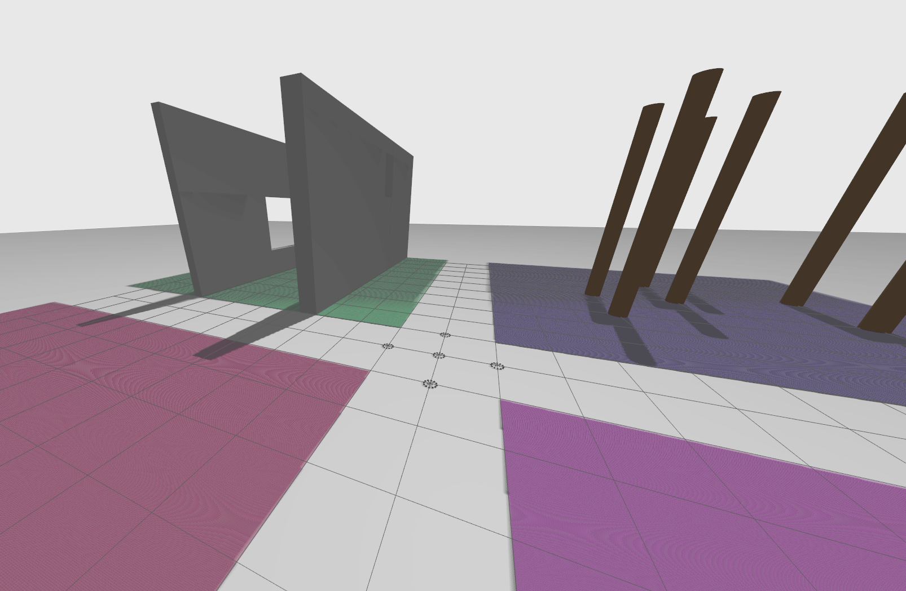
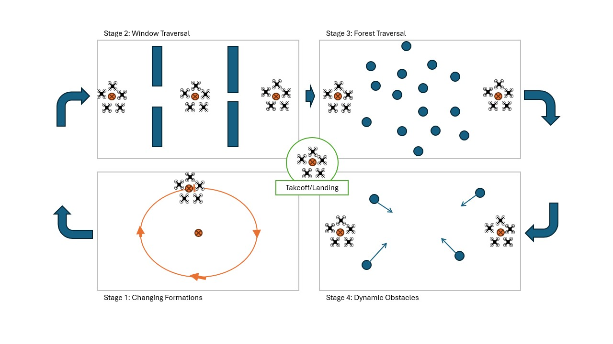

# CW2: Swarming and Multi-Drone Formation Flight Challenge 



## Challenge

This challenge revolves around swarming of drones and formation flight. We are asking you to investigate the difference in performance and application of decentralised swarm based approaches versus centralised approaches to performing formation flight with a group of 5 drones in 4 different scenarios. 

### Swarming and Formation Flight

**Swarming** refers to the collective behaviour of multiple agents (drones) operating together using local rules without a centralised controller. These behaviours emerge from interactions between individual drones and their environment.

Swarm robotics takes inspiration from nature—such as birds, fish, and insects—to design scalable, flexible, and robust robotic systems. Swarm behaviours are often decentralised and self-organised, meaning that individual drones follow simple local rules that collectively result in a global pattern of behaviour.

Common decentralised swarm control strategies:

- Boids Model (Flocking Behaviour) – Uses three simple rules: separation, alignment, and cohesion.
- Potential Fields – Assigns virtual attractive/repulsive forces to goals and obstacles to guide movement.
- Optimisation-based Swarms – Optimisation approach focusing on local decision-making given a set of constraints.
- Bio-Inspired Methods – Use of indirect coordination through share environmental cues such as pheromone-based navigation or genetic algorithms.

**Formation flight** is a more structured approach to multi-agent coordination where drones maintain a specific geometric arrangement while moving. Unlike general swarming, formation flying often requires precise positioning and coordination.

Common formation flight strategies:

- Centralised Approaches
    - Leader-Follower – One drone acts as the leader dictating the trajectory while others maintain a relative position. This can be both centralised and de-centralised. For the latter, this introduces approaches where the swarm my automatically elect a new leader.
    - Multi-Agent Path Planning (MAPF) – Global centralised planning approach computed for the whole route and optimising e.g. for collision-free paths.
    - Virtual Structures – The entire formation is treated as a rigid body and controlled as one unit.
      
- Decentralised Approaches
    - Boids with Formation Constraints – Similar to flocking but with additional formation control.
    - Consensus-Based Control – Drones agree on formation changes based on local communication.
    - Distributed Potential Fields – Drones use attraction/repulsion forces while maintaining formation.

Swarming and formation flight have numerous real-world applications across various industries. 

- In aerial surveillance and search-and-rescue, swarming drones can quickly cover large areas, scan for missing persons, or assess disaster zones without relying on a single point of failure. 
- In logistics and delivery, drone swarms can efficiently transport packages in coordinated formations, optimizing airspace usage and reducing delivery times. 
- In environmental monitoring, swarms of drones can track wildlife migrations, detect deforestation, or monitor air and water quality over vast regions. 
- In entertainment and art, synchronized drone light shows use precise formation flight to create complex aerial displays, offering an innovative alternative to fireworks. 

These examples highlight the versatility of swarm robotics in enhancing efficiency, scalability, and adaptability in real-world operations.

### Your Challenge

We have created a competition style course with 4 different stages to complete one after another. For each of these stages, you need to consider the coordination of 5 drones. 

1. **Stage 1: Changing Formations**: 
    - Implementing the formation flight algorithms which have the ability to changing the formation periodically whilst maintaining a circular trajectory. 
    - Compare different formation shapes (Line, V-shape, Diamond, Circular Orbit, Grid, Staggered)

2. **Stage 2: Window Traversal**: 
    - Using your formation flying methods attempt to maneouever your swarm of drones through two narrow windows slits. 
    - Consider how to split, rejoin, or compress the formation to pass through gaps.

3. **Stage 3: Forest Traversal**: 
    - Using your formation flying methods attempt to maneouever your swarm of drones through a forest of trees.
    - Your swarm should avoid collisions and maintain efficiency in movement.

4. **Stage 4: Dynamic Obstacles**: 
    - Using your formation flying methods attempt to maneouever your swarm of drones through a set of dynamically moving obstacles.  
    - You may need adaptive formation control to respond to changes in real time.



In groups of 2, you will be investigating, developing and testing your algorithm primarily in simulation. You will be given the opportunity to run a viable solution on real crazyflies on the 26th March and 2nd April at UCL HereEast. Points will be awarded on the completion of each stage, and performance within. 

As an incentive to run your solution on hardware at UCL HereEast, groups have the chance to compete and complete Stage 2. A small, low value prize will be provided to the winning solution based on success rate, time take, efficiency and re-configurablity. 

## Challenge Environemnt

Just as with the previous courseworks and gazebo aruco challenges, this will also be within aerostack2 and ros2. At this point you should feel more familiar with the systems and how they all work. To enable this challenge, we have created a new repository specifically for this challenge. 

**The repository is here: [challenge_multi_drone](https://github.com/UCL-MSC-RAI-COMP0240/challenge_multi_drone?tab=readme-ov-file)**

- [https://github.com/UCL-MSC-RAI-COMP0240/challenge_multi_drone](https://github.com/UCL-MSC-RAI-COMP0240/challenge_multi_drone?tab=readme-ov-file)

### Installation

As before, follow the [README.md] in the challenge repository for installation instructions. 

> *NOTE* that we have made a patch for aerostack2 and the crazyflie interface and you will therefore have to pull our versions of these two libraries and build them from source yourself. 

### Running the environment

The README.md goes into full details of each command. 

Many things are the same as your previous courseworks. However a key difference is that we are now running multiple drones. As you can imagine this is much more taxing on your machines, and some approaches to running this coursework may no longer be appropriate. 

Like previous you will need two terminals, both in the root of the repository:

In terminal 1 run the following to launch the drone simulation of scenario1, and you will see gazebo popup.

```bash
./launch_as2.bash -s scenarios/scenario1.yaml
```

And in a second terminal, you can run the ground station, which will spin up the visualisation software `rviz2` as well as provide a prompt for you to run your mission (Though you can run your python mission from everywhere, provided you `source /<your workspace>/install/setup.bash` first)

```bash
./launch_ground_station.bash
# or if you want to play around with teleoperating the drone
./launch_ground_station.bash -t 
```

> **Remember**: If you want to close the simulation down, just run the `stop.bash` script from the repository root in any terminal or tmux window. 


### Bulding your solution
<!-- 
We have provided a very basic sample solution in `mission_scenario.py` which simply reads the scenario file, iterates through the viewpoints and visits them one by one. 

```bash
# From the root of this repository
python3 mission_scenario.py -s scenarios/scenario1.yaml
``` -->

We have released a `scenario1.yaml` which describes a sample environment which contains the 4 stages mentioned within this challenge. 

Have a read of the scenarios file to see some of the parameters you will need to manage. 

> **TODO**: More scenarios will be released shortly for testing. 

## Recommended Tasks

- **Understand the Problem and Setup**:
    - Familiarise yourself with the coursework brief
        - Carefully read the challenge description, objectives, and assessment criteria.
        - Understand the differences between centralised formation flight and decentralised swarm control.

    - Set up the simulation environment
        - Clone the challenge_multi_drone repository from GitHub.
        - Follow the README instructions to install dependencies and patches for Aerostack2 and Crazyflie interfaces.
        - Run a basic test to ensure Gazebo and RViz2 are launching correctly.

    - Analyse the provided scenario1.yaml file
        - Understand the environment parameters (waypoints, obstacles, formation constraints).
        - Identify key parameters you may need to tune for different stages.

- **Implementing Baseline Formation Flight Strategies**:
    - Stage 1: Implement basic formation flight
        - Choose and implement a baseline centrailised approach e.g. leader-Follower model, global multi-agent planning or virtual structure
        - Choose and implement a baseline decentralised apporach e.g. boids-based, consensus-based control, potential fields
        - Compare different formation shapes (Line, V-shape, Diamond, Circular Orbit, Grid, Staggered).
      
    - Test formation transitions
        - Implement periodic formation shape changes while maintaining a circular trajectory.
        - Ensure smooth transitions between formations.

- **Developing Advanced Adaptive Formation Control**
    - Stage 2: Implement Window Traversal strategies
        - Design methods to split, rejoin, or compress the formation to pass through narrow gaps.
        - Compare centralised and decentralised methods for managing formation changes.

    - Stage 3: Implement Forest Traversal strategies
        - Introduce collision avoidance mechanisms while maintaining formation integrity.
        - Test how different formation control methods handle navigation through obstacles.

    - Stage 4: Implement Dynamic Obstacle Avoidance
        - Introduce adaptive reconfiguration to respond to moving obstacles in real-time.
        - Optimise decision-making for obstacle avoidance without breaking formation integrity.

- **Performance Evaluation and Optimisation**
    - Compare performance of centralised vs decentralised approaches
        - Evaluate formation stability, reconfigurability, and efficiency in each scenario.
        - Measure performance metrics such as completion time, success rate, and communication overhead.

    - Optimise computational efficiency
        - Reduce latency and improve real-time response.
        - Tune formation parameters and control gains for smoother transitions.

    - Document findings for coursework submission
        - Provide an analysis comparing both approaches, their strengths, and limitations.
        - Include performance graphs, data plots, and insights from the simulation trials.
        - Discuss real-world applications and trade-offs in different industry scenarios.

## Suggested Group Task Assignments
To ensure a fair workload distribution, each group member should be responsible for complementary tasks while collaborating on integration, testing, and final documentation. Our suggested task division strategy is to split by the development of centralised and decentralised algorithms, allowing flexibility based on skillsets and interests. E.g.:

- Student 1 (Centralised Control)
    - Implement Leader-Follower model, Global Multi-agent Planning or Virtual Structure
    - Test formation transitions using predefined trajectory control.
    - Evaluate control performance for formation maintenance and obstacle avoidance.

- Student 2 (Decentralised Swarm Methods)
    - Implement Boids Model, Potential Fields, and Consensus-Based Control.
    - Develop an adaptive swarm behaviour that responds to environmental constraints.
    - Fine-tune local interaction rules to optimise coordination and robustness.

Regardless of the distribution of tasks, groups meet jointly come together to:
- Compare centralised versus decentralised performance across the different scenarios
- Ensure solutions work in each scenario
- Prepare a report with performance metrics, trade-off analysis and conclusions.
  
## Coursework Submission

To be released

## Assessment Breakdown and Structure (Deadline 23rd April 16.00)

1. **Report Structure (total page count 10 - ~6000 words limit)**
- *Introduction (10%)*
    - Brief Overview: Explain the purpose of the coursework and significance of drone swarming.
    - Problem Statement: What are the challenges in multi-UAV formation flight?
    - Objectives: Define the goal of the report (e.g., evaluating centralised vs. decentralised approaches).
 
- *Methodology (30%)*
    - Formation Flight Strategies:
        - Centralised Approach: Implement one method (e.g., Leader-Follower, Virtual Structures, or Multi-Agent Path Planning).
        - Decentralised Approach: Implement one method (e.g., Boids Model, Potential Fields, or Consensus-Based Control).

    - Swarm Coordination Mechanisms:
        - How do the UAVs maintain formation and avoid collisions?
        - How does formation reconfiguration (splitting/rejoining) work?

    - Implementation Process:
        - Algorithm Design: Explain key design choices.
        - Simulation Environment: Describe ROS2, Aerostack2, and scenario1.yaml configuration.
        - Tuning of Parameters: Explain how you adjusted parameters to optimise performance.

- *Experimental Results & Performance Evaluation (25%) (~3-4 Pages)*
    - Comparative Analysis:
        - Stage 1 - Formation Changes:
            - Success rate of formation transitions.
            - Time taken for different formation types (e.g., Line, V-shape, Diamond).
            - Time taken for completion.
        - Stage 2 - Window Traversal:
            - Success rate (%) of drones passing through gaps, number of collisions.
            - Time taken to rejoin formations.
            - Time taken for completion.
        - Stage 3 - Forest Traversal:
            - Success rate, number of collisions.    
            - Efficiency of obstacle avoidance while maintaining formation.
            - Time taken for completion.
        - Stage 4 - Dynamic Obstacles:
            - Adaptive formation behaviour against moving obstacles.
            - Success rate, number of collisions.
            - Time taken for completion.
     
Other metric to consider is computational time and real-time response.
     
- *Discussion (20%)*
    - Key Insights:
        - Strengths and weaknesses of centralised vs. decentralised approaches.
        - How formation stability, obstacle handling, and adaptability differ between methods.
        - Computational efficiency and real-time response.
      
    - Challenges & Mitigations:
        - Issues encountered in implementation, debugging, or parameter tuning.
        - Solutions applied to overcome performance bottlenecks.

    - Future Improvements:
        - Ideas for improving UAV swarm coordination.
        - Possible hybrid approaches that combine centralised and decentralised control.

- *Conclusion (10%)*
    - Summary of Findings: Key takeaways from experiments.
    - Final Performance Insights: Which method worked best? Under what conditions?
    - Real-World Applications: Discuss how these methods can be used in disaster response, logistics, or surveillance.

2. **Video Submission**
- Length: 5mins
- Format: MP4, max 500mb
- Required Elements:
    - Formation Flight Demonstration – Show formation transitions in the simulator.
    - Obstacle Traversal – Showcase Window and Forest Traversal.
    - Side-by-Side Comparison – Compare Centralised vs. Decentralised approaches.
    - Performance Metrics Overlay – Display success rates and efficiency stats.
    - Brief Narration/Annotations – Explain the observed UAV behaviours.

3. **Code Submission**
- Zip your packages to upload
